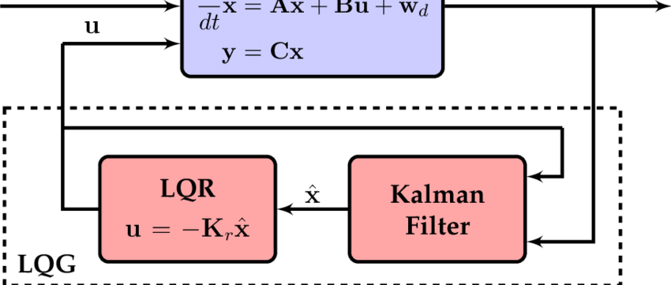

# Important Control Schemes
## Linear Quadratic Gaussian (Optimal Control)

where $w$ is the dynamics white noise and $v$ is the external disturbance white noise

### Separation Principle
If (A, B) is controllable and (A, C) is observable, then LQE and LQR can be seperately optimized then put together while preserving stability. However, this can lead the system to be non-robust sometimes.

