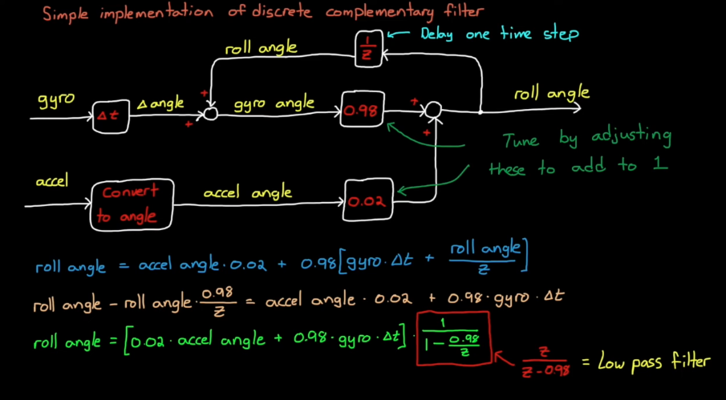

# Drone Control and Complementary Filter

## IMU
### Gyroscope (Gyro)
- **Measures**: *Angular velocity* (rate of rotation) around each axis (x, y, z).
- **Units**: degrees/second (°/s) or radians/second (rad/s).
- **Strengths**:

  - Very good at detecting quick, short-term changes in orientation.
  - Not affected by linear acceleration (e.g., if you shake the sensor).
  
- **Weaknesses**:

  - Needs integration to get orientation → causes **drift** over time.
  - Small constant errors (bias) accumulate when integrated.

### 2. Accelerometer
- **Measures**: *Specific force* along each axis (x, y, z) — includes **gravity** and **linear acceleration**.
- **Units**: meters/second² (m/s²) or g (1 g ≈ 9.81 m/s²).
- **Strengths**:
  - Can give **absolute tilt/orientation** relative to gravity if stationary or moving slowly.
  - No drift over time.
- **Weaknesses**:
  - Very noisy during movement or vibration.
  - Can’t distinguish between gravity and actual movement acceleration.

---

## Continuous Time Complementary Filter
A complementary filter is a simple sensor fusion technique that combines measurements from two (or more) sensors in a way that uses each sensor’s strengths while compensating for its weaknesses.

### Complementary Filter Example - Measuring roll with IMU
1. Dead Reckoning

    - Integrating rate of change at each measurement step by adding it to the current measurement

**Many sensors have trade-offs:**

Accelerometers: Good at measuring long-term orientation (low-frequency information), but noisy and sensitive to vibration.

    - Cannot be trusted at a given second.

Gyroscopes: Good at measuring short-term changes (high-frequency information), but drift over time.

**The complementary filter** blends them:

Simplified filter diagram in practice:

**Low-pass filter** the accelerometer → keeps slow, long-term trends (reduces noise).

**High-pass filter** the gyroscope → keeps fast, short-term changes (reduces drift).

## Discrete Complementary Filter

By believe the Gyro more, we are allowing short-term agility to make it through and also adding a small amount of accelerometer data to nudge it back to prevent drifting

---

# Drone Control in practice

## Sensors
1. Ultrasound sensor - measures altitude or distance above a surface
2. Camera - measures horizontal motion and speed
3. Pressure Sensor - Altitude
4. IMU - Angular rate and Acc

## Hardware
Opposing motors rotate in the same way but different from adjacent motors. This means **Thrust, roll, pitch, and yaw can be commanded independently**.

This design is due to the way yaw interacts with roll and pitch.

### How to command yaw

To change yaw, slow a pair of motors that spin in the same direction down and speed the other pair up. This will still counteract gravity but total torque is not 0. This Design allows drone to yaw without changing thrust, pitch, or roll.

### How to command roll

Decrease either left or right pairs of motors spinning in the opposite direction, causing a rolling torque.

### How to command thrust
Set all motors to the same speed.

### Motor Mixing Algorithm

### Unactuated Directions
Forward, backward, left, and right are unactuated.

### Maintaining Altitude while going in un-actuated directions
To go left, tilt the drone so its thrust force partially counteracts gravity, partially points left. Increase thrust so the vertical component counteracts gravity completely.

---

## Control Diagram

There are our actuators, four sensors, six degrees of freedom (x, y, z, roll, pitch, yaw).
**This is an underactuated system.** Since we don't have an actuator for every motion, some some directions are uncontrollable at any given time.
we are going to develop a controller that couples thrust with rotational dynamics

---

### Control Scheme

Plant: Drone

Desired output: hovering at fixed altitude.

Design goal: how to manipulate the four actuators to maintain altitude.

### Why a simple PID for altitude control wouldn't work
A PID for altitude (same as thrust) control cannot take into account wind gust and other disturbances. Since increasing thrust can only make the drone travel along its **local z axis (pointing down)**. We therefore needs to ensure a level flight. This motivates the next part.

### Why a decoupled four-indenpendent-controller control scheme wouldn't work

This is **undesirable** since **Reference Pitch and Roll may need to be non-zero while hovering**, the drone needs to lean into the wind
    - wind gust can still cause the drone to drift away from its starting coordinates even though the drone would be level.

We **need to couple position errors with roll and pitch** because left, right, forward, and backward movements are not actuated

---

## Drone Altitude Controller

**Note:** We can command **thrust, roll, pitch, and yaw independently**. We can thereby create a feedback controller for each one. To ensure the drone doesn't drift away from the original (x,y) coordinates due to disturbance, we add a cascade loop for position control.

### Important notes on Drone Altitude Controller
1. We need estimated yaw for position controller, due to the fact that we need to coordinate-transform world coordinate of the starting position to drone body frame.

2. We have five parameters that require estimates for: yaw, pitch, roll, altitude, (x, y)
    - Sensor fuse the 4 sensors we have to estimate.

3. We have 6 PIDs to tune with 4 in cascade.
    - We need a great model to simulate drone dynamics

4. The position controller takes the position error as input and output roll and pitch. 

--- 

# Altitude Controller Walkthrough
**Scenario starts**: Altitude correct, but position is a bit off to the left -> position error.

Step 1: P controller of PID request roll angle to fly right, which gives a reference roll angle.

Step 2: Inner loop roll PID takes the reference roll angle from previous step and calculate rolling **torque** (force).

Step 3: Motor-Mix-Algorithm takes rolling torque as input and outputs motor commands, making motors on the left speed up and motors on the right slow down.

**Scenario prgoresses**: Step 3 makes the drone roll to the right, but since the vertical component of the thrust is slightly smaller than gravity when rolled, the drone loses altitude.

Step 4: Altitude controller senses this altitude error and increases thrust.

Step 5: Position error decreases as drone moves to the right, the requested roll angle also drops.

Step 6: Roll PID senses decreases in error, brings drone back to level.

---

# Flight code and simulation

This diagram shows the four components of the Flight Code Software (FCS)

## Flight code software

## Simulate Flight Dynamics

1. A high fidelity nonlinear model to simulate the real world
2. A linear model to test linear controllers

### What's inside the model block?

---

### Tuning the PID controller

start with the simplest model possible
1. Focus on altitude control only (thrust control) first by setting inputs to MMA for roll, pitch, and yaw to 0
2. Assume sensor model plays no role first.

---

# Geometric Controller

$$z^w_d$$ is vector $$z_d$$ expressed in world frame. $$y_d$$ and $$x_d$$ are calculated based on the cross product between desired horizontal yaw vector $$\tilde{x}^w_d$$ and desired thrust vector $$z^w_d$$

Reference:

[Control 1 Notes (MIT VNAV)](https://vnav.mit.edu/material/06-Control1-notes.pdf)

[Geometric controller](https://vnav.mit.edu/material/07-Control2-notes.pdf)

## Inputs and Outputs of the Geometric Controller

### Inputs
1. Desired state $$p_{d}^{w}, \tilde{x}_{d}^{w}$$, and current state $$x, \dot{x}, R, \omega$$. Compute Tracking Error.
2. Positive Constants $$K_p (\text{ or } K_{x}), K_v, K_R, K_\omega$$, for gains.
3. Vehicle params: mass m, inertia J, gravity g.

### Outputs of the Geometric Controller
1. Collective thrust (scalar), a force along body ($$b_3$$)
2. Body moments(vector) $$M \in \mathcal{R}^3$$

---

## Tracking Error

- **Position error**  
  $$
  e_p = p_w - p_w^d
  $$

- **Linear velocity error**  
  $$
  e_v = v_w - v_w^d
  $$

- **Rotation error**  
  $$
  e_R = \frac{1}{2} \left[ (R_w^d)^T R_w^B - (R_w^B)^T R_w^d \right]^\vee
  $$

- **Angular velocity error**  
  $$
  e_\omega = \omega_B - (R_w^B)^T R_w^d \, \omega_d
  $$

---

## Control commands (per tick)
### Translational Side (Outer Loop)
Let $$ R \in SO(3) $$ be the body→world rotation matrix,  
$$ \Omega \in \mathbb{R}^3 $$ the body-frame angular velocity,  
$$ e_3 = [0,\,0,\,1]^\top $$, $$ m $$ the mass, $$ J $$ the inertia matrix.

**Position/velocity errors:**
$$
e_p = x - x_d, \quad e_v = \dot{x} - \dot{x}_d
$$

**Commanded acceleration:**
$$
a_c = -K_p e_p - K_v e_v + g\,e_3 + \ddot{x}_d
$$

**Collective thrust:**
$$
u_1 = m\, a_c^\top (R\,e_3)
$$

### Rotational Side (Inner Loop)

**Attitude/angular velocity errors:**
$$
e_R = \frac{1}{2} \big(R_d^\top R - R^\top R_d\big)^\vee
$$,
$$
e_\Omega = \Omega - R^\top R_d \,\Omega_d
$$

**Moment command:**
$$
M = -K_R e_R - K_\Omega e_\Omega 
    + \Omega \times (J\Omega) 
    - J\left( \hat{\Omega} R^\top R_d \Omega_d - R^\top R_d \dot{\Omega}_d \right)
$$

Where:
- $$ (\cdot)^\wedge $$ is the hat map: $$\hat{a}b = a \times b$$
- $$ (\cdot)^\vee $$ is the inverse of the hat map

---

## Geometric Controller Tuning Guide

### Step A – Attitude Loop Gains ($$k_R$$, $$k_Ω$$)

**Goal:** Make the vehicle track attitude commands quickly and without overshoot.

1. **Freeze position loop**:
   - Hold position constant or give manual attitude commands.

2. **Initial values**:
   - Start small so the response is gentle.
   - Example starting point:
     $$
     k_R ≈ 8 * J_{diag}
     k_Ω ≈ 2 * sqrt(k_R * J_{diag})
     $$
     where $$J_{diag}$$ are diagonal elements of the inertia matrix.

3. **Tune $$k_R$$**:
   - Increase until rotations toward commanded attitude are crisp but not oscillatory.

4. **Tune $$k_Ω$$**:
   - Increase to damp rotation overshoot (derivative-like effect).

5. **Target**:
   - Step response in ~0.2–0.4 s, no sustained oscillations.
   - Watch for motor torque saturation.

### Step B – Position Loop Gains ($$k_x$$, $$k_v$$)

**Goal:** Track position without excessive attitude demands or overshoot.

1. **Fix attitude loop**:
   - Keep $$k_R$$ and $$k_Ω$$ from Step A.

2. **Start small**:
   - Small $$k_x$$ for gentle acceleration toward waypoint.
   - Add $$k_v$$ to damp oscillations.

3. **Increase $$k_x$$**:
   - Raise until position response is as fast as desired without saturating thrust.

4. **Tune $$k_v$$**:
   - For near-critical damping:
     $$
     k_v ≈ 2 * \sqrt{(k_x * m)}
     $$
     where $$m$$ is the mass.

---

# Sliding Mode Control 
In a cascade loop setup, the **matched disturbance** means disturbance that enter through the same channel as the control input to the next controller (ie, output of the current controller). In this case the control input to the *plant* would be the input to the inner loop.

## Why SMC would make sense?
1. Attitude controller (inner loop) takes roll error and pitch error and outputs roll torque and pitch torque, which are forces.
  - Wind gust and payload also changes forces, which means they are matched disturbances in the **attitude loop**
2. Matched disturbances in attitude controller would be wind gust, payload uncertainty, etc, which need to be taken into account. SMC deals well with matched uncertainities.

---

# Disturbance Observer
