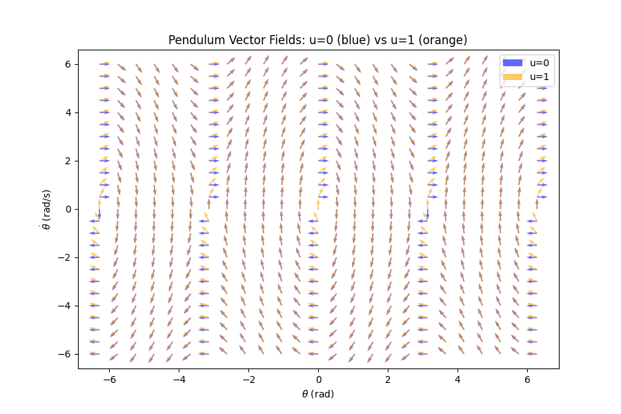

# Manipulator Equation

The general manipulator equation is:

$$
M(q) \ddot{q} + C(q, \dot{q}) \dot{q} = \tau_g(q) + B u
$$

where:
- q is the generalized coordinates of the arm (revolute and prismatic joints)
- $$ M(q) $$: inertia (mass) matrix
- $$ C(q, \dot{q}) $$: Coriolis/centrifugal matrix
- $$ \tau_g(q) $$: gravity torque
- $$ B u $$: additional actuation/input mapping, B is the actuation

---

## 1. Dimensions and Properties of $$ M(q) $$
- **Size:** $$ n \times n $$ for an $$ n $$-DOF robot.
- **Symmetric:** $$ M(q) = M(q)^T $$.
- **Positive-definite:** $$ x^T M(q) x > 0 $$ for all nonzero $$x$$.
- **Depends only on $$ q $$:** not on $$\dot{q}$$ or $$\ddot{q}$$.

---

## 2. General Form
$$ M(q) $$ is derived from the manipulator’s kinetic energy:

$$
T = \tfrac{1}{2} \dot{q}^T M(q) \dot{q}
$$

It accounts for:
- **Rotational inertia** of each link.
- **Mass distribution** (translational inertia).
- **Coupling terms** (off-diagonal) when motion in one joint affects others.

---

## 3. Example: 2-Link Planar Arm
For a 2-link planar manipulator with:
- link lengths $$ l_1, l_2 $$  
- link masses $$ m_1, m_2 $$  
- COM distances $$ r_1, r_2 $$  
- inertias $$ I_1, I_2 $$  
- joint angles $$ q_1, q_2 $$  

the inertia matrix is:

$$
M(q) =
\begin{bmatrix}
I_1 + I_2 + m_1 r_1^2 + m_2(l_1^2 + r_2^2 + 2 l_1 r_2 \cos q_2) &
I_2 + m_2(r_2^2 + l_1 r_2 \cos q_2) \\
I_2 + m_2(r_2^2 + l_1 r_2 \cos q_2) &
I_2 + m_2 r_2^2
\end{bmatrix}
$$

- **Diagonal terms**: inertia seen at each joint.
- **Off-diagonal terms**: dynamic coupling between joints.

---

## 4. Interpretation
- **Diagonal entries**: difficulty of accelerating a single joint.  
- **Off-diagonal entries**: how one joint’s acceleration induces torques in another.  
- $$ M(q) $$ changes with $$ q $$, since link orientations change the inertia distribution.

# Simple Pendulum
**Nonlinear EoM (about the pivot, with viscous damping):**
$$
I\,\ddot{\theta} + b\,\dot{\theta} + m g \ell \sin\theta \;=\; u
$$

- For a point mass at distance $$\ell$$: $$I = m\ell^{2}$$.
- $$u$$ is the torque applied about the pivot (control input).

**State-space form ($$x = [\theta, \dot{\theta}]^T$$):**

$$
\begin{aligned}
\dot{\theta} &= \dot{\theta} \\
\ddot{\theta} &= \frac{u - b\,\dot{\theta} - m g \ell \sin\theta}{I}
\end{aligned}
$$

So,

$$
\dot{x} =
\begin{bmatrix}
\dot{\theta}\\[4pt]
\dfrac{u - b\,\dot{\theta} - m g \ell \sin\theta}{I}
\end{bmatrix}.
$$

**Small-angle linearization (around $$\theta \approx 0$$):**
$$
I\,\ddot{\theta} + b\,\dot{\theta} + m g \ell\,\theta \;=\; u
$$
$$
\ddot{\theta} \approx \frac{u - b\,\dot{\theta} - m g \ell\,\theta}{I}.
$$

## Graphical Analysis - Vector Field

<!--  -->

  
   
  <em>Figure: Control input shapes vector field (u=0 vs u=1 overlay)</em>

For state $$x=\begin{bmatrix}\theta\\ \dot\theta\end{bmatrix}$$ and control torque $$u$$ about the pivot, the dynamics are
$$
\dot{x} = 
\begin{bmatrix}
\dot\theta \\
\frac{u - b\,\dot\theta - m g \ell \sin\theta}{I}
\end{bmatrix},
$$
where $$I=m\ell^2$$ for a point mass at distance $$\ell$$. Each vector $$[u,v]^T$$ at coordinate $$(\theta, \dot{\theta})$$ would be shown on the vector field.

**Note:** Since u is only present in the second element in the vector, changing $$u$$ only changes the **vertical component** of this vector field.