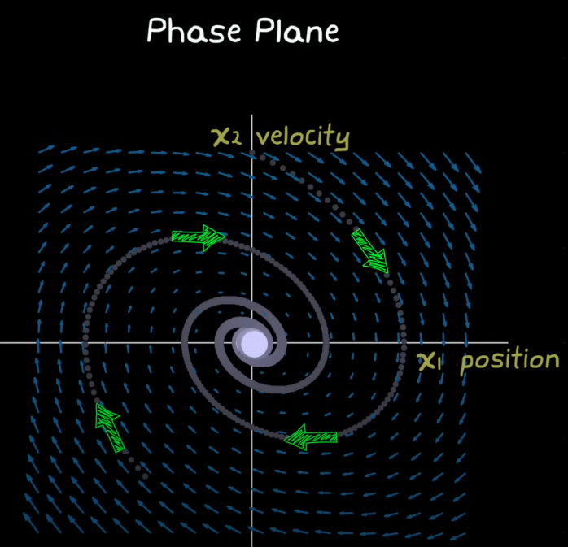

# Sliding Mode Control Overview

$$
u = (C^T g(x))^{-1}(-C^T f(x) + h(S(x)))
$$

where $$S = C^T x$$ is the switching function and describes the sliding surface. 

$$
\dot{x} = f(x) + g(x) u(t)
$$

Reachability Condition: 
$$
S \dot{S} < 0
$$

Generalized Reaching Function:
$$ \dot{S} = h(S(x)) $$ 

## Two phases of Sliding Mode
1. Phase 1: *reaching phase*
    - Trajectories converges to sliding manifold in finite time.
2. Phase 2: *sliding phase*
    - After reaching the sliding manifold, trajectories are confined in the S = 0 sliding manifold.
    - In this phase, the dynamics of the system are represented by the reduced-order model $$\dot{x}_1 = -bx_1$$, where $$C = [b, 1]^T$$ and $$ S = b x_1 + x_2$$. 
    - This is because $$\dot{x}_1 = x_2$$

## Fundamental Trade-offs
1. Higher gain leads to higher robustness (better disturbance rejection)
2. Higher gain also leads to chattering
3. Chattering can be addressed in other ways than reducing gain.

**Notes**:
1. Sliding Mode control constraints a 2-nd order system to a straight line that describes the sliding surface.
2. Sliding Mode control applies to higher order systems. 

---

## Sliding Mode Control Core Idea

To constrain the trajectories so they can only exist in a slice on the plane.

  <figure style="text-align: center;">
    
    <figcaption>Mass-Spring-Damper Phase Plane</figcaption>
  </figure>

  <figure style="text-align: center;">
    
    <figcaption>Mass-Spring-Damper Sliding Mode Phase Plane</figcaption>
  </figure>

The yellow line is the sliding surface (when switching function is set to 0), and is the product of slide mode control constraining the trajectories to that slice of the plane.

**Note:** 
1. This transforms a second order system to a first order system defined by the setting the switching function to 0.
2. Switching function $$S = b x_1 + x_2 = 0$$.
3. In general, **$$ S = C^T x$$**
4. For mass spring damper $$C=[b,1]^T$$

Next step is to actually constrain the trajectory to a single line.

### Constraining the Trajectory (Changing the vector field)

  <figure style="text-align: center;">
    
    <figcaption>Constraining trajectory by changing vector field</figcaption>
  </figure>

  <figure style="text-align: center;">
    
    <figcaption>Example constrained trajectories</figcaption>
  </figure>

### Sliding Mode Control Robustness
Zooming into the plane we can see how disturbances are rejected.

 <figure style="text-align: left;">
    
    <figcaption>Robustness and Disturbance Rejection</figcaption>
</figure>

**Note:**

1. Orange Arrow denotes the disturbance, blue arrow denotes the controller vector field, and green arrow denotes the net vector.
2. If disturbance is big, increase the controller gain (bigger blue arrow)
3. However, even though higher gain can overpower disturbance, it also leads to **chattering**, which is exacerbated by delay.

## Dealing with Chattering Logic (Used to Modify Reaching Law Later) 

### What is Chattering?
1. One of the causes of chattering is the big gains. Similar to switch problem in PID gain scheduling, sliding model big gains causes chattering by providing **drastically different gains for smaller changes in error**, resulting in small oscillations along the sliding manifold.

2. Delay can also cause chattering. Sign changes are not registered instantaneously in the real world.

### Method 1: Linear Saturation
<figure style="text-align: left;">
    
    <figcaption>Dealing with Chattering</figcaption>
</figure>

1. Define a boundary
2. Use full gain to deal with disturbances outside of the boundary
3. Linearly reduce the controller gain the closer it gets to the switching surface.

### Other Methods
Other models besides Linear Saturation exist - Relay, Hyperbolic Tangent ...

---

## Sliding Mode Control in Second Order Systems
We are going to investigate Sliding Mode control for a spring-mass-damper system. The state vector $$\vec{x}$$ is

$$
\vec{x} = [x, v]^T
$$

State space is:

$$
\dot{x}_1 = x_2,
$$

$$
\dot{x}_2 = h(\vec{x},u)
$$

### Mass Spring Damper

$$
M \ddot{x} + D \dot{x} + Kx = u(t)
$$

$$
\dot{x} =
\begin{bmatrix}
0 & I \\
- M^{-1} K & - M^{-1} D
\end{bmatrix} x
+
\begin{bmatrix}
0 \\
M^{-1}
\end{bmatrix} u
$$

$$
y =
\begin{bmatrix}
I & 0
\end{bmatrix} x
$$

$$
\dot{x} = f(x) + g(x) u(t)
$$

## Sliding Mode Controller Fundamental Equations (Reachability Condition)

$$
S * \dot{S} < 0
$$

This is because S needs to converge to 0, so
1. if S > 0, then $$\dot{s} < 0 $$
1. if S < 0, then $$\dot{s} > 0 $$

### Designing S and $$\dot{S}$$ (Naive)
Given the Reachability Condition, we have a few options:

1. $$ \dot{S} = - \eta * sign(S) $$ (Constant Rate Reaching Law)
2. $$ \dot{S} = - \eta * sign(S) - K S $$ (Exponential Reaching Law)
3. $$ \dot{S} = h(S(x)) $$ (Generalized Reaching Function)

However, $$sign()$$ switches harshly and causes chatter. We will replace it with $$\theta$$ later on.

### Deriving Sliding Mode Control Law
$$
\dot{S} = \frac{\partial S}{\partial x} * \frac{dx}{dt} = h(S(x))
$$

We can therefore solve for u(t) for the control law.

## Dealing with Chatter in Reaching Law
Instead of using $$sign(x)$$, we can replace it with Boundary Layer to add saturation into the system.

### Saturation Function ($$\theta$$)
Let $$\phi$$ be the distance between each of the boundary lines to the sliding manifold.

$$
\theta(x) = \begin{cases}
    1 & \text{if } S > \phi \\
    \frac{S}{\phi} & \text{if } |S| \le B \\
    -1 & \text{if } S < \phi
\end{cases}
$$

## Modified Reaching Laws for Chattering
1. $$ \dot{S} = - \eta * \theta(S) $$ (Modified Constant Rate Reaching Law)
2. $$ \dot{S} = - \eta * \theta(S) - K S $$ (Modified Exponential Reaching Law)
