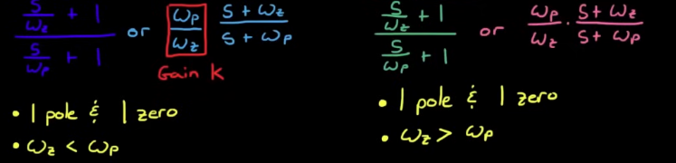
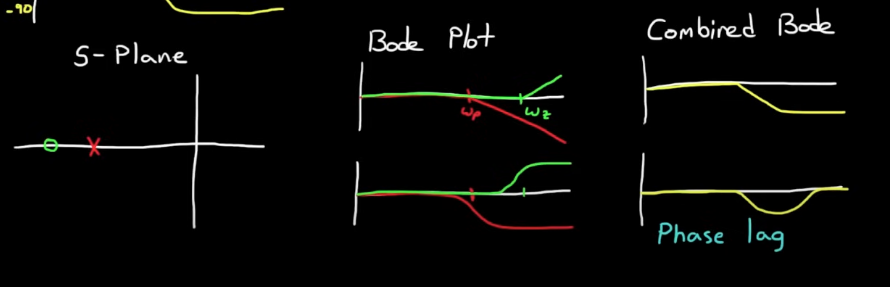
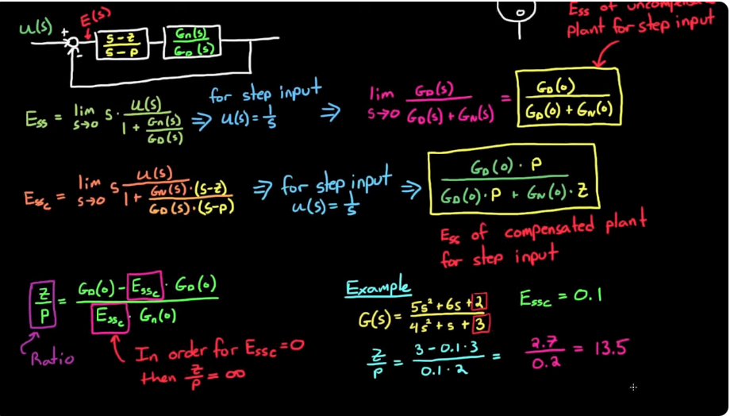
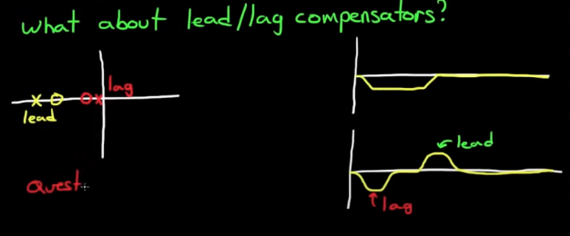
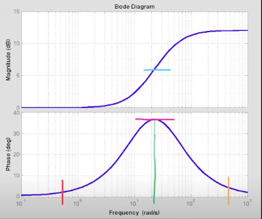
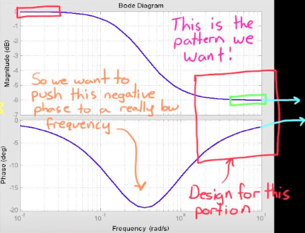
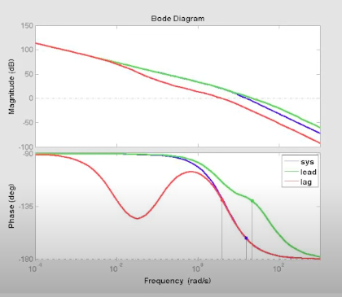
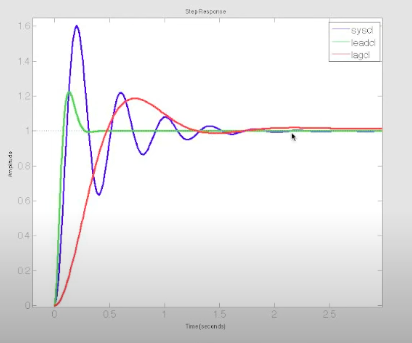

# Lead, Lag, and Lead-Lag Compensators
## Phase Margin
### Definition
Phase margin is a measure of stability for a feedback control system. It represents the amount of phase shift, expressed in degrees, that can be added to the open-loop transfer function before the system reaches the point of instability, specifically where the Bode plot crosses the -180° line at the gain crossover frequency.

---

### Phase Margin Calculation:

$$
\text{Phase Margin} = 180^\circ + \angle G(j\omega_{gc})H(j\omega_{gc})
$$

- $$ \omega_{gc} $$ is the **gain crossover frequency** — the frequency at which the **magnitude** of the open-loop transfer function 
$$ |G(j\omega)H(j\omega)| = 1 $$ (i.e., **0 dB**).
- $$ \angle G(j\omega)H(j\omega) $$ is the **phase** of the open-loop transfer function at that frequency.

---

## Phase Lead and Lag
A zero (s) adds phase while pole (1/s) subtracts phase.

Phase lead compensators add positive phase to the output, so the output leads the input.  
Phase lag compensators add negative phase to the output, so the output lags behind the input.

### Phase Lead
Example: Differentiator

input: sin(t) output: cos(t)

Cosine is leading sine by 90 degrees -> phase lead

A differentiator circuit introduces a positive phase shift of 90 degrees

### Phase Lag
Example: Integrator

---

## Lead Lag Compensator Formulae

---

## Lead Compensator

### Formula
$$\frac{\omega_p}{\omega_z} * \frac{s+\omega_z}{s+\omega_p}$$ or
$$\frac{s+\omega_z}{\omega_z} * \frac{\omega_p}{s+\omega_p}$$

1. 1 pole and 1 zero
2. **$$ \omega_z < \omega_p $$**

### Bode Plot

1. Lead compensators *increase gain at high frequencies* **but not as much as a real zero = less noise amplification**
2. Lead compensator adds phase (phase lead) between the corner frequencies $$\omega_z \text{ and } \omega_p$$ and nowhere else. By adjusting the corner frequencies, you can move the phase lead around

### Intuition

1. Lead compensator (phase lead) drags the asymptotes and the closed loop poles to the left, which adds stability.

    - Lead compensated system is more stable and has a faster rise time.
    - Lead compensator shapes the root locus

2. Lag compensator is typically **not** used for dragging asymptotes closer to imaginary axis, but rather for reducing steady-state errors.

    - We want to reduce steady-state errors without changing the pole locations
    - Lag compensator doesn't shape the root locus plot

### Notes on Lead Compensators
1. A lead compensator doesn't guarantee stability
2. Lead compensator can be tried if PID doesn't work
3. Faster response means responding to noise

---

## Lag Compensator

### Formula
$$\frac{\omega_p}{\omega_z} * \frac{s+\omega_z}{s+\omega_p}$$ or
$$\frac{s+\omega_z}{\omega_z} * \frac{\omega_p}{s+\omega_p}$$

1. 1 pole and 1 zero
2. **$$ \omega_z < \omega_p $$**

### Lag Compensator Bode Plot

### How does Lag compensator reduce SSE

Lag compensator can only reduce SSE but not eliminate it. To eliminate, change system Type.

### Lag Compensator Step Response

$$E_{ssc}$$ is the desired steady-state error given by spec.

$$\frac{z}{p} $$ is the zero-to-pole ratio and can be calculated. However, the exact location needs further analysis

### Where should you place the zero and pole given zero-to-pole ratio

A locus exists where the angles add to 180 degrees. We do NOT want to move the dominant pole much with lag compensators. We want to place them in such a way that the angles of the compensator zero and pole cancel each other out.

- If we place the zero and pole to the left of the dominant poles, the difference between the two angles will be significant, which will drag the dominant poles to the right (undesirable behavior).

- If we place the zero and pole close to the imaginary axis but keep zero-to-pole ratio $$\frac{z}{p}$$

**Rule of Thumb**
1. Maintain $$\frac{z}{p}$$ needed for steady-state error
2. Place lag compensator as close to imaginary axis as possible to reduce moving the roots.
    - Not too close since it's hard to implement
    - Zero should be $$Z_{lag} = \frac{\text{real(Dominant Pole)}}{50}$$

---

## Lead Lag Compensator

---

## Designing a Lead-Lag compensator with Root Locus

### Designing Lead first

1. Decide on desired poles given criteria (making the system appear second order) (e.g. rise time, damping ratio)

2. Place lead zero in a position that minimizes effect on dominant closed-loop poles

    - Keep zero left of closed-loop poles OR

    - Cancel an existing system pole

3. Find where lead pole needs to be placed to get desired poles on root locus

    - For a desired pole (either one of the complex conjugate, answers are the same), ignoring its complex conjugate pole in the following formula:
        $$\Sigma \theta_z - \Sigma \theta_p = -180^\circ$$
    
    - Use trigonometry to figure out $$l$$ and $$\theta$$, distance between each open-loop pole and zero and angle between the line that connects a desired pole to each of the open-loop poles or zeros and the positive x-axis, respectively.
    
4. Find what gain (K) this desired pole corresponds to:

    - $$K = \frac{\Pi L_{poles}}{\Pi L_{zeroes}} $$, where $$\Pi$$ is the multiplication function OR

    - $$ K = \frac{1}{|GH|} $$

### Designing Lag

5. Calculate SSE with lead controller using Final Value Theorem and determining the **type** of the system
    - Lag compensator will reduce SSE

6. Find ratio $$ \frac{z}{p} $$ from SSE criteria where $$e_{lead\_lag}$$ is the desired SSE given by spec.
    - $$ \frac{e_{lead}}{e_{lead\_lag}} = \frac{z}{p} $$

7. Pick $$P_{lag}$$ or $$Z_{lag}$$ so it is close to the origin, typically $$Z_{lag}$$.

8. Calculate $$P_{lag}$$ given the ratio $$ \frac{z}{p} $$. Should end up with $$Z_{lag}$$ and $$P_{lag}$$ very close to each other to have pole-zero cancellation and an almost unchanged root locus plot

### Dominant poles and System Requirement Constraints

Many system requirements pertaining to transient response (rise time, overshoot, settling time) are only well-defined for a second-order system. It is therefore important to determine where the dominant poles should reside to resemble a second-order system.

### Pole Placement
1. If the dominant poles are to the **left** of the uncompensated root-locus, then **lead** must be added to the system.

2. If the dominant poles are to the **right** of the uncompensated root-locus, then **lag** must be added to the system.

---

## Designing a Lead Compensator with Bode Plots

### Equations of Lead Compensator in Frequency Domain 
1. $$ \text{Lead } = \frac{\alpha_2 * \tau * s + 1}{\tau s + 1} $$, where $$\alpha_2 > 1$$, and $$\alpha_2 = \frac{\omega_p}{\omega_z}$$ is the pole-to-zero ratio.
2. Upper Cutoff frequency $$ \omega_{high} = \omega_p = \alpha \omega_z = \frac{1}{\tau}$$.
3. Lower Cutoff freqeuncy $$ \omega_{low} = \omega_z = \frac{1}{\alpha_2 \tau} $$.
4. Maximum Phase Lead Compensator can provide: $$ \phi_{max} = sin^{-1}(\frac{\alpha_2 - 1}{\alpha_2 + 1})$$.
5. Maximum Frequency at which $$\phi_{max}$$ occurs. $$ \omega_{m} = \frac{1}{\tau \sqrt{\alpha_2}} $$
6. Gain at $$ \omega_{m} $$ = $$ \sqrt{\alpha_2} $$

**Note:** 

### Step 1: Always Start with System Type
If you have a steady state error $$E_{ss}$$ requirement for a given input, then checking system type and adding the corresponding number of integrators must be the first step.

Adding an integrator (pole at 0) generally imposes complexity in your design and in your hardware. It is therefore **not recommended** to add an integrator just to drive $$E_{ss}$$ to 0. A finite $$E_{ss}$$ is often enough.

### Step 2: Choose gain to meet Ess requiremnt
Calculate the gain necessary to drive $$E_{ss}$$ below the specified requirement.

$$
E_ss = \lim_{s \to 0} s * E(s) = \lim_{s \to 0} \frac{R(s)}{1+G(s)}
$$

### Step 3: Draw Bode Plot of G(s) and Verify if Phase Margin Satisfies the requirement.
1. Calculate the Phase Margin based on the plot

### Step 4: Designing a Lead Compensators with Equations
1. Choose a $$\phi_{max}$$ -> solve for $$\alpha_2$$.
2. Choose a $$\omega_m$$ -? solve for $$\tau$$.
3. Constuct Lead Compensator.

### Step 5: Evaluate New Phase Margin (There's a catch!)
While Lead Compensator adds damping and increases the phase margin, it increases the gain from the zero frequency $$\omega_z$$ as well, which reduces phase margin, so full phase margin cannot be achieved. To mitigate this:
1. Design desired phase lead to be bigger than required OR
2. Build a table over a range of $$\alpha_2$$ and pick the best.

**Note:** Even though the theoretical maximum phase lead one can add with lead compensator is $$90^\circ$$, one should only try to add $$55^\circ$$. If you need more than $$55^\circ$$, you would need two lead compensators **in series**.

---

## Designing a Lag Compensator with Bode Plot

We want the critical region where the system needs more gain margin to the right of the red box. The phase lag needs to be added at really low frequencies.

### Lag Compensator

### Important Notes
1. While a lead compensator adds phase margin by changing the phase plot, a lag compensator can also add phase in the critical region by **reducing the gain plot** at the critical region, **keeping the $$E_{ss}$$, and not disturbing the phase plot. 

### Problem Setup
Our current phase margin is $$18^\circ$$, but we want the phase margin to be 

### Steps to design a lag compensator
1. Compute the frequency ($$\omega_r$$)at which the phase margin requirement is set (frequency at which Phase Margin = $$48^\circ$$).
2. Compute the Gain at that frequency ($$G_r$$) and add a little extra gain to ensure the compensator fulfills the requirement (18 dB -> 20 dB).
3. 20 dB = a factor of 10. Therefore, the lag compensator becomes $$\frac{\tau s + 1}{10 \tau s + 1}$$
4. Place the zero ($$\omega_z$$) approximately 50 times closer to the origin as the dominant pole.
5. $$\tau = \omega_z$$

---

## Comparing Lead Lag Compensators

Even though Phase Margins are the same for both compensated systems, lead composator **increased $$\omega_{gc}$$**, the gain crossover frequency, while the lag compensator **decreased $$\omega_{gc}$$**.

$$\omega_{gc}$$ is related to the speed of the control system, as shown in the picture below.

### Potential benefits of a slower system
1. A slower system won't react as much to high frequency noise.
2. A slower system is safer if you're uncertain about your high frequency modes.

