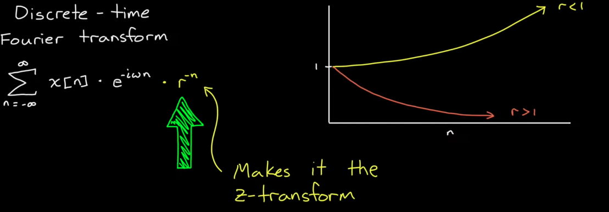

# Discrete-Time Control

## Continuous vs Discrete Time domain (Analog vs Digital)
1. Quantization Error would be introduced and can be minimized. There is a trade-off between bits, measurement range and quantization error.
2. Discrete time (digital) systems introduce delay, which introduces lag and reduces bandwidth of controller.

## Discretizing the system
Two ways to approach this problem.

## Discrete Time Fourier Transform
The **Discrete-Time Fourier Transform (DTFT)** of a discrete-time signal $$ x[n] $$ is defined as:

$$
X(e^{j\omega}) = \sum_{n=-\infty}^{\infty} x[n] e^{-j\omega n}
$$

This calculates how correlated the time domain signal is with all frequencies. 

**DTFT** works on finite time signals unlike Z transform.

## Z domain and Z transform
Z transform can be considered as the discrete-time counterpart of the Laplace Transform.
The **Z-transform** of a discrete-time signal $$ x[n] $$ is defined as:

$$
X(z) = \sum_{n=-\infty}^{\infty} x[n] z^{-n}
$$

where $$z = r*e^{i \omega}$$

An n time delay in z domain would be $$\frac{1}{z^n}$$.

### Z transform vs DTFT

### Intuition
1. Z transform calculates the correlation between the time domain signal and combinations of both sinusoids and exponentials, which solves most linear shift invariant systems.
2. Unlike DTFT, Z transform has convergence problems
    
    - For instance, for infinite discrete time signal, when there's no frequency profile, when the probing signal grows at the same rate at which time signal decays, the sum goes to infinity. (See figure below) Even though all subsequent smaller r would also make the sum $$\infty$$, the first instance when the sum does not converge is when a perfect correlation has been found. A pole exists here.

    - For a finite discrete time signal, the sum for z transform always converges. We therefore cannot investigate finite time signals with Z transform without an assumption (signal = 0 for rest of time). In such a case DTFT is useful.

---

## Z plane and Z domain

Z domain is the discrete counterpart of the Laplace S domain. However, Z-domain is not a straight discretization of the S-domain, rather Z domain maps S-domain into a unit circle in polar coordinates as explained below.

### Z Plane and S Plane

Z plane is in polar coordinates, while S plane is in Cartesian coordinates.

 

Since $$z = r*e^{i \omega} = e^{sT} = e^{\sigma + i \omega T}$$, the real part $$e^{\sigma T}$$ scales the circle. The black line enclosing the unit circle and separates the inside and outside of the circle in the Z plane corresponds to the Imaginary axis in the S plane. $$e^{i \omega T}$$ traces a circle.

For a continuous domain, there are infinite frequencies so S plane goes from $$-\infty$$ to $$\infty$$. However, in discrete systems, frequency only goes from $$[-f_{nyquist}, f_{nyquist}]$$ on the imaginary axis (real axis on S plane still goes to infinity). 

$$
f_{nyquist} = f_{sampling} / 2
$$

Since frequency is represented by the angle between a line and positive x-axis on the Z plane, Nyquist frequency represents the 

Defining $$z = e^{sT}$$ makes implementing physical hardware easy, since inverse Z transform to difference equation is trivial. This is due to the fact that $$z^{-1}$$ corresponds to a single time step delay in time domain for the difference equation.

Note the coefficients of the difference equation correspond to those in the transfer function. This makes the inverse Z transform trivial.

---

## Discretization Method

There are 5 different methods:
1. Zero Order Hold
2. First Order Hold
3. Impulse
4. Tustin
5. Matched

ZOH (step invariant), FOH (ramp invariant), and Impulse invariant all produce specific time-domain responses.

The method you choose depends on what you are trying to accomplish. (Minimizing the loss of important info.)

1. We may want the frequency response of the discrete system to be the same as the continuous system. (Notch filter)
2. We may want the step response to be the same.

**Note** If the time constant of your system is slow compared to the sample time, all methods are the same. When time constant is bigger, these 5 methods produce different results by prioritizing different aspects.

### Impulse Invariant Method

This method ensures the discrete impulse is the same as the continuous impulse response. Note that Matlab defines impulse differently than Kronecker delta and is **scaled by** $$T_s$$.

Impulse invariant method uses an impulse train as inputs, which is not realistic. ZOH is more realistic. Impulse invariant method would yield **erroneous step response**.

---

### Zero Order Hold (Step Invariant Method)

ZOH holds the value at the previous time step until the next time step is reached. However, ZOH method would yield **inaccurate impulse response**.

Walkthrough:
1. Start with discrete time domain signal $$v_{k}$$ (discrete motor commands, discrete sensor readings ...)
2. Convert the discrete time signal $$v_{k}$$ to continuous time signal $$v_t$$, which is fed to continuous plant (G(s))
3. The continuous time signal $$v_t$$ is fed to continuous plant (G(s)) which produces Y(s)
4. Sample the continuous frequency domain output to get discrete frequency domain output

ZOH is created by subtracting a delayed step function from another undelayed step function

$$
\frac{Y(s)}{V{s}}=\frac{z-1}{z} * \mathcal{Z}(\frac{G(s)}{s})|_{t=kT} 
$$

### Using Zero Order Hold in discrete controller design 
Model-based design:

1. Method 1: Discretize the plant -> design discrete controller. We need to use ZOH

    - Everything is represented by discrete transfer functions.

2. Method 2: Design a continuous controller with a continuous plant model -> discretize the controller. ZOH is implied

    - Need to use other methods to discretize the continuous controller other than ZOH (Tustin or Matched method)

Notes:

1. If you are building a **hybrid system** with a discrete controller and continuous plant, ZOH is implied.
2. However, when designing a continuous controller based on continuous plant, ZOH is not assumed. Tuning continuous controller without ZOH effect then discretizing the continuous controller may yield unstable behavior. 
3. A ZOH needs to be explicitly added between controller and plant to ensure the effect of ZOH is taken into account. However, ZOH is nonlinear and classical methods for continuous controllers can't handle nonlinearity.
4. Padé Approximation solves this problem by approximating ZOH with a transfer function, allowing us to use classical methods to design the controller then actually discretize it with Tustin method.

---

## Bilinear Transform \(Tustin Method\) - discretizing a continuous controller
The Bilinear Transform is another method for converting a continuous system into a discrete system.

### Formulae
Bilinear Transform:

$$
s = \frac{2}{T} \frac{z-1}{z+1} 
$$

Inverse Bilinear Transform:

$$
z = \frac{1+ \frac{T}{2} s}{1 - \frac{T}{2}s}
$$

**Solving the first formula for s would yield the second one.

## Why does Binlinear Transform work
1. Interpretation 1:
The bilinear transform is essentially a linear first order approximation of $$z=e^{sT}$$ with Taylor Series. However, rather than $$z \approx 1+ ST$$, we use a fraction to better estimate the exponential. To do this, we first split $$e^{sT} = e^{\frac{sT}{2}} * e^{\frac{sT}{2}} = \frac{e^{\frac{sT}{2}}}{e^{\frac{-sT}{2}}}$$.

2. Interpretation 2: Trapezoidal Integration.

## Matched Method (Not widely used!)
This method brings every pole in S domain to Z domain.

---

## Bilinear Transform Mapping
Bilinear Transform warps the s-plane differently than the Z transform described above. In this mapping the three infinities - $$ \pm \infty$$ for **s**-plane imaginary axis and $$-\infty$$ for real axis of the s-plane. The imaginarry axis of s-plane wraps around the unit circle. The -1 point is the Nyquist frequency on the z-plane.

### Frequency Warping Equation
$$
\omega_d = \frac{2}{T} atan(\omega_a \frac{T}{2})
$$

where $$\omega_d$$ is the discrete frequency after bilinear transform and $$\omega_a$$ is the analog frequency. At low frequencies, $$\omega_a = \omega_d$$. As frequency increases, the warping becomes bigger.

This creates an issue for discretizing continuous filter to get discrete filter. To resolve this issue, we can pre-warp the analog frequency.

### Pre-warping spec analog frequency (Modified Bilinear Transform)
$$
s = \frac{\omega_0}{tan(\frac{\omega_0 T}{2})} \frac{z-1}{z+1}
$$
where \omega_0 is the frequency specification.

---

## Discrete Notch filter design example

### Notch filter (Band stop filter) 
1. Critical frequency $$\omega_0$$, center of the notch
2. Q - how deep and narrow the notch is

### Steps
We first design the filter in continuous domain and craft the perfect analog filter. Then use bilinear transform to deploy the filter on a digital computer.

**Step 1**: Design the filter in continuous domain

**Step 2**: Pre-warp the critical frequency $$\omega_0$$

**Step 3**: Use bilinear transform to convert the continuous filter to discrete filter.

