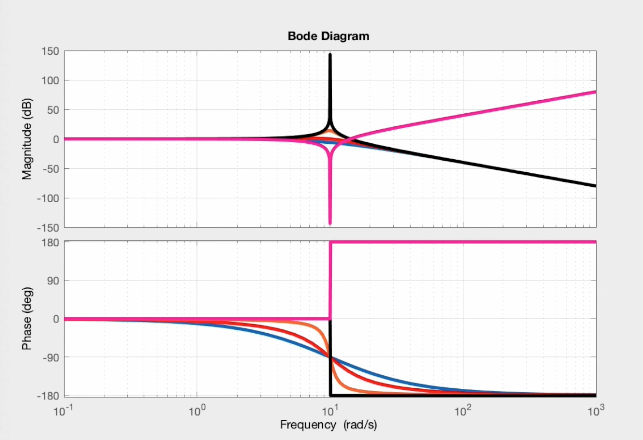

# Notch Filter or Band Stop Filter (For Resonance)

### Why Low-Pass + High-Pass doesn't Work
Since first-order low pass and high pass filters have stop-band slopes at $$\pm 20 dB/decade$$, the closer the two filters get, the smaller the attentuation gets. This implementation therefore doesn't hold well for narrow band filters.

## Reliable Notch Filter Implementation

### Damping and Bode Plot Bumps
For a second order system, damping directly relates to the bumps or peaks in the Bode plot of the transfer function.

1. A critically damped system have repeated poles with no bumps in the Bode Plot.
2. An under-damped system have a bump at the resonance frequency.
3. A system with no-damping has infinite gain at renonsance.

### Notch Filter
1. **Step 1**: Take the inverse of the un-damped transfer function to get the narrow notch. This inverts the resonance frequency bode plot, and we get a narrow band-stop at resonance frequency. We just need to flatten the band to the right of the notch.
2. **Step 2**: Add two poles **symmetric** with respect to the notch frequency. The closer together the poles are, the narrower the notch.
3. **Step 3**: The gain at notch frequency can be attenuated by adding damping to the numerator, which affects the depth of the notch.

$$
\underbrace{\frac{s^2 + 2\zeta s + \omega_n^2}{\omega_n^2}}_{\text{undamped or lightly damped zeros} \\ \text{ (inverted from resonance system)}}\!
\cdot
\underbrace{\frac{a \omega_n}{s+a \omega_n}}_{\text{pole $a$ times higher than $\omega_n$}}\!
\cdot
\underbrace{\frac{\frac{\omega_n}{a}}{s+\frac{\omega_n}{a}}}_{\text{pole $a$ times lower than $\omega_n$}}
$$

We multiply and divide by a for symmetry since x-aix of bode plot is log scale. Division equals subtraction in this case.

1. Set width of notch with a
2. Set notch dept with $$\zeta$$
3. Set notch location with $$\omega_n$$

