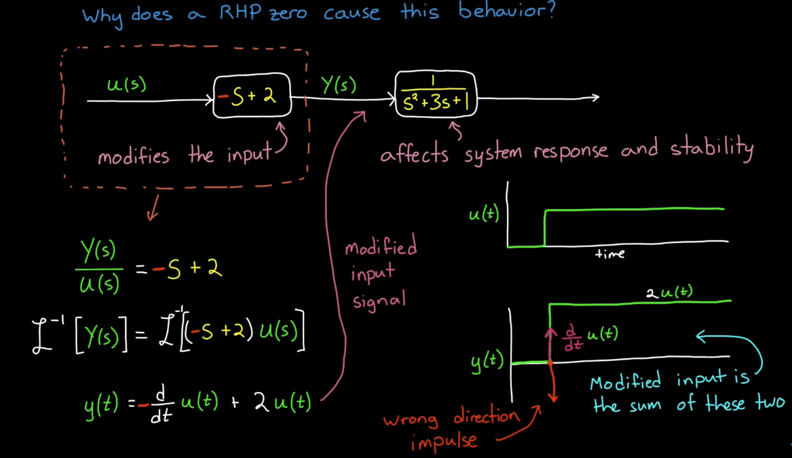
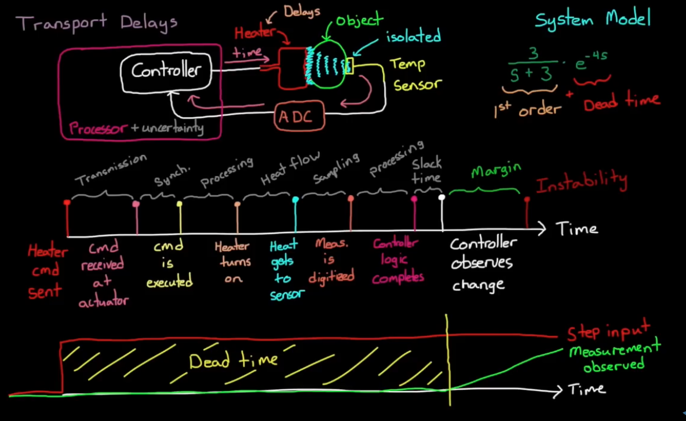

## Quick Notes on Damping
### Underdamped, Critically damped, and Overdamped (Only defined for second order systems)
Underdamped: imgarinary poles

Cirtically damped: repeated poles (eigenvalues)

Overdamped: Real eigenvalues

For a standard second-order transfer function:

$$
G(s) = \frac{\omega_n^2}{s^2 + 2\zeta \omega_n s + \omega_n^2}
$$

For a standard second-order system:

$$
\ddot{y}(t) + 2\zeta \omega_n \dot{y}(t) + \omega_n^2 y(t) = K \omega_n^2 u(t)
$$

---

The standard second-order system in differential equation form is:

$$
\ddot{y}(t) + 2\zeta \omega_n \dot{y}(t) + \omega_n^2 y(t) = K \omega_n^2 u(t)
$$

**1. Underdamped** ($$0 < \zeta < 1$$):

$$
y(t) = e^{-\zeta \omega_n t} \left[ A \cos\left( \omega_n \sqrt{1 - \zeta^2} \, t \right) 
+ B \sin\left( \omega_n \sqrt{1 - \zeta^2} \, t \right) \right]
$$

**Critically damped** ($$\zeta = 1$$):

$$
y(t) = \left( A + Bt \right) e^{-\omega_n t}
$$

**Overdamped** ($$\zeta > 1$$):

Let:
$$
r_{1,2} = -\omega_n \left( \zeta \pm \sqrt{\zeta^2 - 1} \right)
$$

Then:
$$
y(t) = A e^{r_1 t} + B e^{r_2 t}
$$

### Damping in higher order systems
Damping behavior is only defined for second order systems. Dominant poles are investigated for general behavior for higher-order systems.
### Damping and Bode plot
A peak in the frequency response (magnitude plot) happens when the system has complex conjugate poles that are **lightly damped**.

---

## Fourier and Laplace Transforms

**Note:** In Laplace domain, $$s=\sigma + j\omega$$. When evaluating Laplace Transform at $$s=j\omega$$, Laplace Transform becomes Fourier Transform. 

**When you go from the Laplace transform $$F(s)$$ to the Fourier transform $$F(j\omega)$$, you’re essentially looking at the steady-state sinusoidal response of the system.**

### Laplace Transform
$$
\mathcal{L}\{f(t)\} = F(s) = \int_0^{\infty} e^{-st} f(t) \, dt
$$

Laplace Tranform is a generialized form of Fourier Transform. Specifically, Fourier Transform evaluates Laplace Transform at $$i\omega$$, with no real parts, ie. Fourier Transform only evaluates purely imaginary arguments for Laplace Transform.
**Inpulse response** h(t) given $$u = \delta(t)$$ is $$L^{-1}{G(s), \text{ where } Y(s) = G(s)X(s)}$$ ie the inverse Laplace Transform of the Transfer function (G(s))
### Fourier Series

If $$f(t)$$ is a periodic function with period $T$, its **Fourier series** representation is:

$$
f(t) = a_0 + \sum_{n=1}^{\infty} \left[ a_n \cos\left(\frac{2\pi n t}{T}\right) + b_n \sin\left(\frac{2\pi n t}{T}\right) \right]
$$

The coefficients are given by:

$$
a_0 = \frac{1}{T} \int_{-T/2}^{T/2} f(t) \, dt
$$

$$
a_n = \frac{2}{T} \int_{-T/2}^{T/2} f(t) \cos\left(\frac{2\pi n t}{T}\right) dt
$$

$$
b_n = \frac{2}{T} \int_{-T/2}^{T/2} f(t) \sin\left(\frac{2\pi n t}{T}\right) dt
$$

You can also write the Fourier series using **complex exponentials**:

$$
f(t) = \sum_{n=-\infty}^{\infty} c_n e^{i 2\pi n t / T}
$$

with coefficients:

$$
c_n = \frac{1}{T} \int_{-T/2}^{T/2} f(t) e^{-i 2\pi n t / T} dt
$$

---

### Fourier Transform

For non-periodic functions, the **Fourier Transform** is used. The **continuous-time Fourier transform (CTFT)** of a function $f(t)$ is:

$$
F(\omega) = \int_{-\infty}^{\infty} f(t) e^{-i \omega t} dt
$$

The **inverse Fourier transform** is:

$$
f(t) = \frac{1}{2\pi} \int_{-\infty}^{\infty} F(\omega) e^{i \omega t} d\omega
$$

Alternatively, in terms of frequency $$f$$ (Hz) instead of angular frequency $\omega = 2\pi f$:

$$
F(f) = \int_{-\infty}^{\infty} f(t) e^{-i 2\pi f t} dt
$$

$$
f(t) = \int_{-\infty}^{\infty} F(f) e^{i 2\pi f t} df
$$

**Intuition** Fourier Transform converts a time-domain $$\bar{x}(t)$$ to frequency domain $$X(f)$$. This investigates how much of this specific frequency exists in the signal.

Fourier Transform returns a **complex number**:
1. The **magnitude** of this number denotes how strong that frequency is in the signal
2. The **angle** of the complex number signifies the phase offset of that frequency - i.e., where that sine wave starts relative to time zero.

---

## Non-minimum Phase

**Motivation**: For the same magnitude gain plot, phase plots can be drastically different. This is due to the fact that multiple transfer functions can produce the same magnitude gain plot, but have different phase profiles.

**Note**: Non-miminum phase can be primarily caused by three phenomena: 1. Time delay $$e^{-sT}$$ 2. RHP zeroes 3. Non-causal/Inverse-unstable Dynamics (Non-causal systems depend on input in the future)

Inverse-unstable systems (RHP in zero -> inverse system has RHP pole (unstable inverse))

Green curve is for time delay, and red curve is for RHP zero.

### Why does RHP zeroes cause system to go the opposite way first

Long story short, RHP zeroes take derivative on the input with the $$(-S)$$ term, which means the derivative has opposite sign from the input, which causes the system to react in the opposite way before correcting. The number of RHP zeros correspond to the number of times the step response needs to change direction.

## Why is RHP zero undesirable and what makes it hard to control

1. Moving in the opposite way first slows down the response

2. Increasing the controller gain can make it unstable. (cart keeps going to the left initially because of increased error, which causes increased control effort, which in turn makes the cart keep going in the wrong way before full throttle to the right.)

3. NMP systems have smaller phase margins because of the additional phase lag.

4. NMP systems are more susceptible to the gain. Increasing the gain increases the gain crossover frequency, which decreases phase margin.

### RHP examples

1. Inverted pendulum: System: x coordinate of the cart. behavior: the cart goes left first, causing the pendulum to to slightly right, before moving right again and causing the pendulum to balance.

2. Aircraft altitude control: System: altitude of the aircraft. behavior: to gain altitude, the aircraft needs to drop the elevator first before rising.

### How to deal with RHP zeroes with controller

1. Having a pole in the controller that cancels out the zero in the plant is risky since the output of the controller can be unbounded even though the output of the plant (the entire system) can be stable.

2. Predictive or nonlinear controllers

3. Easiest: lower controller gain to maintain stability and increase phase margin.

---

## Bode and Nyquist Plots

### Frequency Response

$$ \frac{\bar{x}}{\bar{u}}$$

**Notes:** 
1. The bode plots are plotted in log scale. A small bump in Gain plot corresponds to huge response at resonate frequency. 
2. At extremely low frequency, this system displays no gain at all hence Gain = 0 for low frequencies. At high frequencies, the sytems doesn't have the capacity to respond in times hence the gain drops asymptotically to zero or $-\infty$ in log scale.

---

## Time Delays

### Non-distorting Delays
Every frequency is delayed by the same amount, the shape of the signal doesn't change (transport delay).
### Distorting Delays
Each frequency of a given signal is delayed by a different amount, given by the Bode plot.

### Time Delay Issues
1. Controller has to use old information.
2. Controller has to predict the future - effectively lowers sample time and erodes phase margin.
3. As a result, the system becomes laggy.

### Time Delay Types
1. Unintentional Delays - by-product of the design (not included on purpose)
    - All actuators, processes, sensors add phase delay. 
    - Even controller may add phase delay by design.
    - Faster sensors, less noisy sensors, etc.
2. Transport Delays (picture below)
3. Internal Delay

### Transport Delay

Various sources of transport delay are identified in the picture.

### Internal Delay

For some systems, one can replace time delay with **Pade Approximation**.

To estimate time margins for highly non-linear systems, ie. systems that can't be approximated well with a linear model, add a Delay Margin block and estimate the Margin.

If the system design doesn't have a satisfactory delay margin, either design a slower controller or try to eliminate the delays from source.
