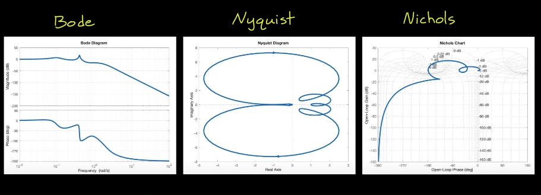
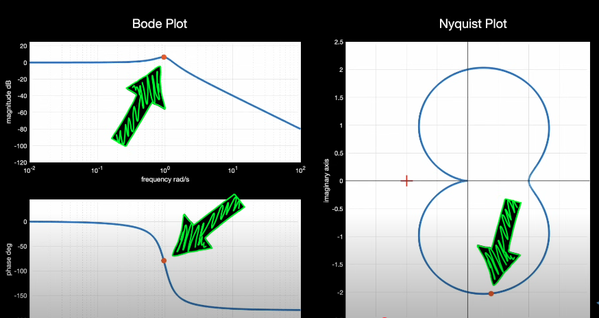
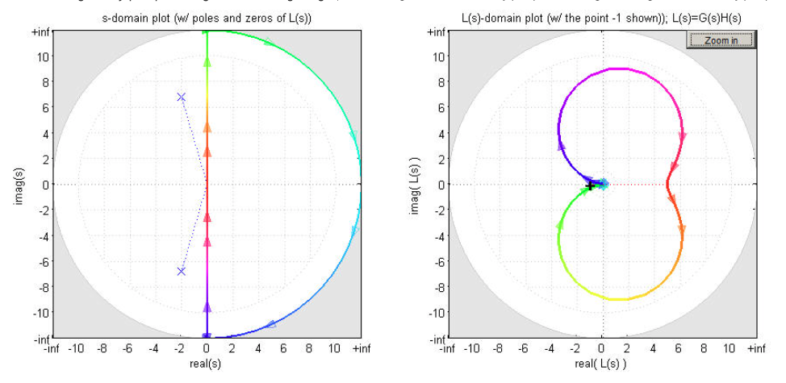
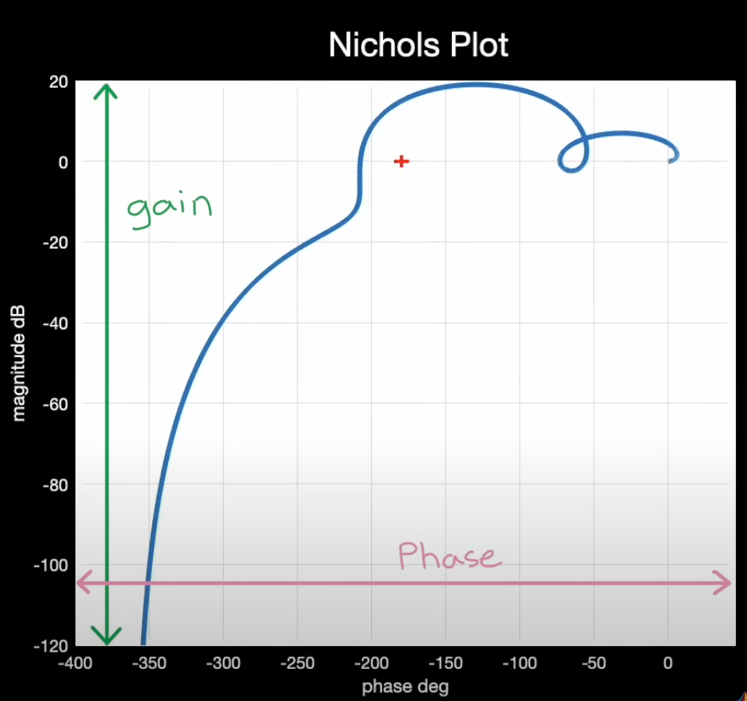

# Nichols Chart, Nyquist Plot, and Bode Plot

All three plots display 3 Key information about the system: 1. **Gain** 2. **Phase** 3. **Frequency**

## Which to Use? A comparison
**All three display the same information just in different ways**
Bode Plot is useful for Loop shaping.
Nyquist Plot and Nichols Plot are useful for general sensitivity and stability analysis.

## Intuition

Bode plot is extremely useful when analyzing open loop frequency reponse  $$G(s)$$ of **minimum phase and stable systems** to predict the beahvior of the closed loop system $$\frac{G(s)}{1+G(s)}$$.
However, Bode plot falls apart when dealing with non-minimum phase or unstable systems. This is where **Nyquist plot** comes in useful. Nyquist plot displays all three in one plot (Gain, Phase, Frequency).
Nichols encodes Bode magnitude and phase plots into one single plot, displaying same information as the Nyquist plot in cartesian coordinates.

---

## Nyquist Plot
<!-- 

  -->

### Important Notes on Nyquist Plot

1. If the open loop system is stable (ie. $$L(s)$$ doesn't have any RHP poles), Nyquist plot should not encircle -1 and if it does, it means the closed loop system is unstable.
2. If the open loop system is unstable (ie. there are RHP poles), Nyquist plot needs to encircle the -1 point $$N = Z - P$$ times **clockwise**. This way the closed loop system is stable and the open loop system is called stabilizable.
3. For a **strictly proper** or **non-strictly proper** transfer function, all infinite points not on the imaginary axis on the S-plane are mapped to one single point on the W-plane
  1. For strictly proper systems, that point is the origin.
  2. For nonstrictly proper systems, that point is a non-zero constant with **no phase** ie the point lies on the positive x-axis.

### Nyquist Plot Stability analysis (benefits)
1. for minimum phase and stable open loop systems, don't corss the cricitical point (-1,0)
2. Gain margin and Phase Margin can be read from Nyquist Plot
3. We can still use Nyquist Stability Criterion and Nyquist plot even for unstable open loop systems
4. Easier to see combinations of gain and phase (**disk margin**)
5. Information displayed in polar coordinates.

### Nyquist Plot Critical Point
Avoid (-1,0) on Nyquist plot if the system is open-loop stable. Closed-loop system oscillates at that point (marginally stable).

### Nyquist Plot Intuition

Nyquist plot is the plot in the W-plane resulting from a transfer function mapping the Nyquist contour on the S-plane to a plot on the W plane.

In the S-plane, for **proper and strictly proper transfer functions** all RHP infinite points (not on the imaginary axis) are mapped to a single point in W-plane since in W-plane 

$$ \text{Phasor Magnitude} \propto \frac{\Pi \text{magnitude of zero phasors in s}}{\Pi \text{magnitude of pole phasors in s}} $$

1. For a **strictly proper transfer function** (number of zeros < number of poles), this point is the origin.
2. For a **proper** transfer function (number of zeros = number of poles), this point is a non-zero constant real value.

### Plotting Nyquist plot by hand
Step 1: Substituting $$s=j \omega$$ into the give transfer function.

Step 2: Sweep $$\omega$$ from 0 to $$\infty$$.

Step 3: Draw its reflection about the real axis in W-plane for negative frequencies (in S-plane).

### Step 2 frequency sweeping walkthrough:

We can use 4 points to approximate this.
1. $$\omega = 0$$
2. $$\omega = \infty$$
3. Imaginary intercepts
4. Real intercepts

To get the intercepts in 3 and 4, follow these steps:
1. Substituting $$s=j \omega$$ into the give transfer function.
2. Factor out the real components and the imaginary components.
3. Set real part to 0 for imaginary intercepts.
4. Set imaginary part to 0 for real intercepts.

### Nyquist Plot Use cases

A fighter jet open loop system has one slightly positve real pole which makes the system slightly unstable (by design). Bode plot doesn't work on this scenario, but Nyquist plot can help. Count the number of CW encirclements of -1!

---

## Nichols Plot 

Frequency is not explicitly shown just as Nyquist plot

## Applications

### System Identification with Bode Plot

Given a **blackbox** LTI system, feeding in signals of various frequency (**Sine sweep**) and observing the output can generate the bode plot of the transfer function.

### System Design and Analysis with Bode plot
Fundamental Principle: Open loop system can provide insightful information about the close loop system.
Let open loop system = G(s) = L(s) = P(s) * K(s), closed loop system =  $$\frac{G(s)}{1+G(s)}$$

**Applications of Bode plot**
1. If $$G(s)$$, an open loop system transfer function has any 0 dB and -180 degrees phase frequencies (G(s)=-1+0j), then closed loop $$\frac{G(s)}{1+G(s)}$$ will oscillate. Bode plot can be used to check.
2. If open loop system is miminum phase and stable, (both zeroes poles are on the LHP), then we can determine closed loop easily through bode plot

**Key Observation**
Bode-plot restatements of Nyquist Criterion (margins)

Let $$\omega_{gc}$$ 
be a gain-crossover frequency where 
$$ |G(j\omega_{gc})|=1 $$
, and let $$ \omega_{pc} $$ be a phase-crossover frequency where 
$$\angle G(j\omega_{pc})=-180^\circ$$.

- **Phase margin condition (at gain crossover):**
  $$
  |G(j\omega_{gc})|=1 \quad \Rightarrow \quad \angle G(j\omega_{gc}) > -180^\circ
  $$
  (positive phase margin). This ensures the Nyquist plot does **not** cross the real axis at or left of $$-1$$.

- **Gain margin condition (at phase crossover):**
  $$
  \angle G(j\omega_{pc})=-180^\circ \quad \Rightarrow \quad |G(j\omega_{pc})| < 1
  $$
  (positive gain margin). This keeps the Nyquist locus inside the unit circle when it is at $$-180^\circ$$, avoiding the point $$-1$$.

If **both** conditions hold for all relevant crossovers and $$P=0$$, the loop has positive stability margins and the closed loop is stable.