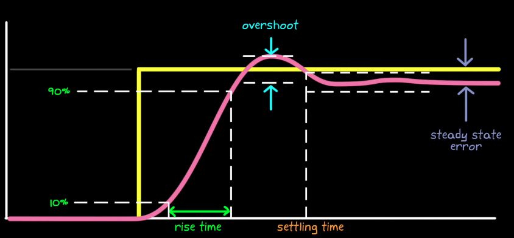

# Performance Specifications
## Control System Specs → Design Actions Cheat Sheet

<table border="1" cellpadding="5" cellspacing="0">
<tr>
<th>Requirement / Spec</th>
<th>What It Means</th>
<th>Design Adjustments</th>
</tr>
<tr>
<td><b>Steady-State Error (Ess)</b></td>
<td>Final tracking error to step/ramp inputs</td>
<td>Increase <b>system type</b> (add integrator), adjust <b>Ki</b> in PID, or use <b>lag compensator</b></td>
</tr>
<tr>
<td><b>Rise Time (tr)</b></td>
<td>Speed to reach near-final value</td>
<td>Increase system bandwidth, add <b>lead compensator</b>, increase <b>Kp</b></td>
</tr>
<tr>
<td><b>Overshoot (Mp)</b></td>
<td>How much output exceeds target</td>
<td>Increase <b>damping ratio</b> (reduce Kp, increase Kd), use <b>lead-lag</b> tuning</td>
</tr>
<tr>
<td><b>Settling Time (ts)</b></td>
<td>Time to stay within ±X% band</td>
<td>Increase natural frequency, increase damping via <b>derivative gain</b> or <b>lead compensation</b></td>
</tr>
<tr>
<td><b>Damping Ratio (ζ)</b></td>
<td>Oscillation level in transient</td>
<td>Adjust Kd or use lead to increase phase margin</td>
</tr>
<tr>
<td><b>Gain Margin (GM)</b></td>
<td>How much gain can increase before instability</td>
<td>Add phase lead, reduce open-loop gain</td>
</tr>
<tr>
<td><b>Phase Margin (PM)</b></td>
<td>Extra phase lag before instability</td>
<td>Add phase lead, adjust crossover frequency</td>
</tr>
<tr>
<td><b>Bandwidth</b></td>
<td>Frequency range of good tracking</td>
<td>Increase gain/lead for faster response, but watch noise</td>
</tr>
<tr>
<td><b>Disturbance Rejection</b></td>
<td>Suppress low/high frequency disturbances</td>
<td>Add <b>integrator</b> for low-freq rejection, notch filters for specific frequencies</td>
</tr>
<tr>
<td><b>Noise Sensitivity</b></td>
<td>Avoid amplifying sensor noise</td>
<td>Reduce bandwidth, use low-pass filter on derivative term</td>
</tr>
<tr>
<td><b>Control Effort Limit</b></td>
<td>Actuator magnitude/rate constraints</td>
<td>Add <b>rate limiter</b>, reduce aggressive gains, use anti-windup</td>
</tr>
</table>

---

## Steady-State Error (SSE)

- **Definition:** $$ e_{ss} = \lim_{t\to\infty} e(t) $$
- **Using FVT:** $$ e_{ss} = \lim_{s\to 0} s\,E(s) $$ 
- **System type & error constants**
  - Type 0 → $$K_p$$, step error finite; ramp error ∞
  - Type 1 → $$K_v$$, step error 0; ramp error finite; parabolic ∞
  - Type 2 → $$K_a$$, step & ramp 0; parabolic finite
- **Typical specs:** “SSE ≤ 2% for step,” etc.

<!-- Steady-State Error (SSE) Chart: Type 0/1/2 systems -->
<section id="sse-chart">
  

  

    <table class="sse-table">
      <caption>Steady-State Error (Unity Feedback, Stable CL, FVT valid)</caption>
      <thead>
        <tr>
          <th scope="col">System Type</th>
          <th scope="col">Step Input R(s)=1/s</th>
          <th scope="col">Ramp Input R(s)=1/s2</th>
          <th scope="col">Parabolic Input R(s)=1/s3</th>
        </tr>
      </thead>
      <tbody>
        <tr>
          <th scope="row">Type 0</th>
          <td><strong>ess = 1 / (1 + Kp)</strong> finite</td>
          <td><strong>ess = &infin;</strong></td>
          <td><strong>ess = &infin;</strong></td>
        </tr>
        <tr>
          <th scope="row">Type 1</th>
          <td><strong>ess = 0</strong></td>
          <td><strong>ess = 1 / Kv</strong> finite</td>
          <td><strong>ess = &infin;</strong></td>
        </tr>
        <tr>
          <th scope="row">Type 2</th>
          <td><strong>ess = 0</strong></td>
          <td><strong>ess = 0</strong></td>
          <td><strong>ess = 1 / Ka</strong> finite</td>
        </tr>
      </tbody>
    </table>
  

  

    Definitions (with <code>L(s) = C(s)G(s)</code>, the open-loop transfer function):
     
    <code>Kp = lim_{s→0} L(s)</code>,
    <code>Kv = lim_{s→0} s·L(s)</code>,
    <code>Ka = lim_{s→0} s²·L(s)</code>.
  

  

    
Assumptions & Notes

    <ul>
      <li>Unity feedback structure and stable closed-loop (no RHP poles, FVT valid).</li>
      <li>“Type” = number of pure integrators in <code>L(s)</code> (i.e., number of poles at the origin).</li>
      <li>FVT form for error: <code>e_ss = lim_{s→0} [ s·E(s) ] = lim_{s→0} [ s·R(s)/(1+L(s)) ]</code>.</li>
    </ul>
  

</section>

### Final Value Theorem (FVT)
- **Statement:** If all poles of $$ sX(s) $$ are in the open left half-plane (no RHP poles, no repeated poles on the imaginary axis), then
  $$
  \lim_{t\to\infty} x(t) = \lim_{s\to 0} s\,X(s).
  $$
- **Common pitfalls:** Undamped oscillators, marginally stable poles, or non-proper forms invalidate FVT.
- **Using FVT to get SSE:**
  $$
  e_{ss} = \lim_{s\to 0} s\,E(s) = \lim_{s\to 0} s\left[\frac{R(s)}{1+L(s)}\right]
  $$
  for unity feedback, with $$L(s)=G(s)C(s)$$. 

  $$R(s)$$ = Input to the control system (reference) in laplace domain

  $$C(s)$$ = Controller transfer function

  $$G(s)$$ = Plant transfer function

  $$L(s)=C(s)G(s)$$ = Open-loop transfer function

---

# Design Specs
In classical Control Theory, design and performance specs are defined with respect to a **step response** in the time domain.

While a step response of a system may look like anything, the step response of a **low-pass filter** is typically used to specify the requirements for **trajectory and reference tracking**.

However, other design specs exist and step response requirement depends entirely on the system.

## Classical Requirements for a Reference-Tracking System
### System Definition
Linear, low pass filter-like, second order, no finite zeros.

$$
G(s) = \frac{\omega_n^2}{s^2+2 \zeta \omega_n s + \omega_n^2}
$$

### Classical Requirements

We can simplify this system requiremnts to just 2 parameters:
1. **Natural Frequency** $$\omega_n$$.
2. **Damping Ratio** $$\zeta$$.

Changing the Damping ratio $$\zeta$$ changes all time-domain parameters (rising time, settling time, overshoot ... ), while changing natural frequency has no effect on overshoot and only changes rise time and setting time.

Increasing $$\zeta$$ would in general:
1. Reduce overshoot.
2. Increase rise time.
3. Increase settling time.

Increasing $$\omega_n$$ would in general:
1. Reduce rise time and settling time.

