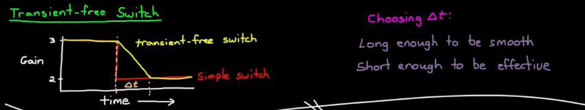
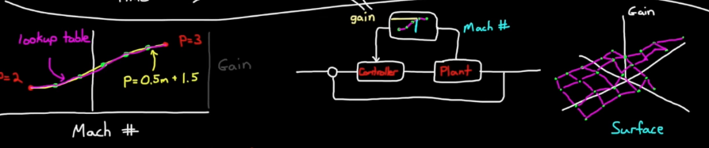

# PID Control
This page only covers continuous-time PID control. For more advanced topics on discrete PID, visit Discrete Time Control page for more details. 

PID by itself is a linear controller. Gain Scheduling, Anti-windup schemes, derivative filtering, gain scheduling can make it non-linear

## Which controller to use?
$$
\begin{array}{c|c|c|c}
Example & System Order & Controller & Reasoning\\
\hline
\text{Controlling mass position using force} & 2 & \text{PD or PID} & \text{Typically needs damping like mass-spring damper, otherwise will oscillate} \\
\text{Controlling V across C using current} & 1 & \text{P or PI} & \text{not much danger of over-shoot or oscillation}  \\
\text{Controlling I across R using voltage} & 0 & \text{P or PI} & \text{not much danger, direct mapping}
\end{array}
$$

**Note** System order denotes how many 'integration' away is your control input from output. For instance controlling position with force would be a second order system.
## PI vs PD vs PID
The derivative controller is highly sensitive to noise and may throw system into instability.

### PI controller
PI controller reduces both rise time and the steady state errors of the system. Integral term introduces phase lag, which may slow down response time.

### PD controller
A PD controller reduces transients like rise time, overshoot, and oscillations in the output. D controller cannot exist on its own since itself doesn't stabilize the system, but amplifies noise.

---

## Strategies for Tuning a PID Controller

### Diagram Walkthrough
1. Model representation

2. run input sequence
   - observe step response for Cohen-Coon

3. Heuristic Methods:
   System model not required, only need to measure certain traits such as process gain, time constant. and dead time. 
   1. Cohen-Coon
   2. Zeguler-Nichols (needs to be careful on hardware, due to oscillatory behavior)

4. System Identification.
   1. Measure step-response of system. 
   2. Tweak your model coefficients so step responses match.
   3. Model needs to be defined beforehand.

5. Tuning method with Model
   - manual tuning
      1. pole placement
      2. Loop Shaping
      3. Heuristic Methods. (make model oscilatory NOT hardware)

   - auto tuning

### Manual PID Tuning Strategy

1. **Start with:**

$$
K_P > 0, \quad K_I = 0, \quad K_D = 0
$$

2. **Increase $$ K_P $$** until:
   - The system starts responding to setpoint changes.
   - It begins to **oscillate consistently without settling**.

   This means it's reached the **edge of stability**.

3. **Back off $$ K_P $$** by ~10–20% to get a stable (but responsive) system.

4. **Increase $$ K_D $$** to:
   - Dampen the oscillations.
   - Improve settling time and reduce overshoot.

5. **Increase $$ K_I $$** slowly to:
   - Eliminate steady-state error (e.g. small drift from setpoint).
   - Watch for **overshoot or oscillation** due to **integral windup**.

---

## 🧪 Ziegler–Nichols Method (Ultimate Gain Method)

This is a classical tuning rule. It gives you a starting point for 
$$
K_P,\ K_I,\ \text{and}\ K_D
$$
based on when the system first starts oscillating.

### 🔧 Steps:

1. **Set:**
$$
K_I = 0,\quad K_D = 0
$$

2. **Increase $$ K_P $$** until the system output shows **sustained oscillations** (constant amplitude).

   - That value of $$ K_P $$ is called the **ultimate gain**, denoted:
$$
K_u
$$

3. **Measure the oscillation period** — the time between peaks — and call it:
$$
T_u
$$

### 📐 Use these tables to compute gains:

| Controller | $$ K_P $$         | $$ K_I $$                  | $$ K_D $$             |
|------------|-------------------|----------------------------|-----------------------|
| **P**      | $$ 0.5K_u $$      | –                          | –                     |
| **PI**     | $$ 0.45K_u $$     | $$ 1.2K_u / T_u $$         | –                     |
| **PID**    | $$ 0.6K_u $$      | $$ 2K_u / T_u $$           | $$ K_u T_u / 8 $$     |

| Control Type           | $$K_p$$        | $$T_i$$            | $$T_d$$            | $$K_i$$                 | $$K_d$$                 |
|------------------------|----------------|---------------------|---------------------|--------------------------|--------------------------|
| **P**                  | $$0.5K_u$$     | –                   | –                   | –                        | –                        |
| **PI**                 | $$0.45K_u$$    | $$0.8\overline{3}T_u$$ | –                   | $$0.54K_u / T_u$$        | –                        |
| **PD**                 | $$0.8K_u$$     | –                   | $$0.125T_u$$        | –                        | $$0.10K_u T_u$$          |
| **Classic PID**        | $$0.6K_u$$     | $$0.5T_u$$          | $$0.125T_u$$        | $$1.2K_u / T_u$$         | $$0.075K_u T_u$$         |
| **Pessen Integral Rule** | $$0.7K_u$$   | $$0.4T_u$$          | $$0.15T_u$$         | $$1.75K_u / T_u$$        | $$0.105K_u T_u$$         |
| **Some Overshoot**     | $$0.3\overline{3}K_u$$ | $$0.50T_u$$ | $$0.3\overline{3}T_u$$ | $$0.6\overline{6}K_u / T_u$$ | $$0.1\overline{1}K_u T_u$$ |
| **No Overshoot**       | $$0.20K_u$$    | $$0.50T_u$$         | $$0.3\overline{3}T_u$$ | $$0.40K_u / T_u$$        | $$0.06\overline{6}K_u T_u$$ |

---

### ⚠️ Notes for Drone Applications

- Ziegler–Nichols gives **aggressive** tuning, often with **overshoot**.
- For drones, it's safer to:
  - Start with **rate control loops** (angular velocity).
  - Then move to **attitude control** (roll, pitch, yaw).

---

## Integral Windup
Error builds up even though actuator saturates. takes take for negative error to be reflected in the controller

### Anti-Windup
**Most anti-windup schemes prevents integral from accumulating error past a threshold**
1. clamping: two checks (if both true, shut off integration)
    - Output is saturating (clamp the output of the PID (**this needs to be conservative**), if the output before and after the clamp are the same, then actuator is beginning to get saturated.)
    - Input and output have same sign
2. block calculation
3. observer approach

## Derivative Control
Derivative control "predicts the future" in constrast to integral control - a decrease in error gives a decrease in control input. Noise amplifies Derivative control output.

### Derivative Control Example
Altitude Control for Quadcopter:
Desired altitude 50m, as drone shoots up, error term decreases (negative derivative) -> negative value from derivative term, slows motors down, reduce over shoot

---

## How to derive a model
### First principles
This methods also works if one knows the individual components of the system.
1. Newtonian Mechanics
2. Lagrangian Mechanics

### System ID
If the model is too complicated, system ID can work (black box method). No need to know the details of the system.

---

## PID Pole Placement (LQG) and Loop Shaping (Robust Control)

### PID Transfer Function
$$
C(s) = K_p + \frac{K_i}{s} + K_d s
$$

### How does PID affect Loop Shaping (Bode Plot):
**1. Proportional term ($$K_p$$)**
- Simply scales the magnitude of the open-loop transfer function across all frequencies by $$ K_p $$ (shifts the Bode magnitude plot up or down).
- No slope change, no phase lead/lag (phase stays the same as the plant’s at each frequency).

**2. Integral term ($$ \frac{K_i}{s} $$)**
- Adds a pole at $$ s=0 $$ and a zero at $$ s=-K_i/K_p $$ (if expressed in standard form for PI control).
- In the Bode plot: increases low-frequency gain slope by +20 dB/dec below the zero, giving **better low-frequency tracking** and disturbance rejection.
- Phase: introduces **–90° lag** below the zero frequency (eventually reduced to 0° after the zero).

**3. Derivative term ($$ K_d s$$)**
- Adds a zero at the origin and a pole at infinity (in practice, implemented with a high-frequency roll-off to avoid noise).
- In the Bode plot: increases high-frequency gain slope by +20 dB/dec above the zero’s frequency, giving **phase lead** and faster response.
- Phase: can give up to +90° lead around its zero.

**Putting them together in loop shaping:**
- **Integral** boosts the low-frequency magnitude to push the gain crossover lower and improve steady-state accuracy.
- **Derivative** boosts magnitude at mid-frequencies to increase phase margin, which can stabilize a plant with low natural phase margin.
- **Proportional** shifts the entire magnitude plot up or down to meet your crossover frequency and gain margin targets.

---

## PID Effect on Pole Placement

### 1️⃣ Starting point — closed-loop poles come from $$ 1 + L(s) = 0 $$

For unity feedback:

$$
T(s) = \frac{C(s) G(s)}{1 + C(s) G(s)}
$$

The **closed-loop poles** are the roots of:

$$
1 + C(s) G(s) = 0
$$

Adding a PID means replacing $$C(s)$$ with:

$$
C(s) = K_p + \frac{K_i}{s} + K_d s
$$

That changes the polynomial $$1 + C(s) G(s) = 0$$, which changes the pole locations.

---

### 2️⃣ How each term influences pole placement

**(a) Proportional $$K_p$$**
- Multiplies the plant’s transfer function by a constant.
- Effect: Moves the closed-loop poles along the *root locus* without changing its shape.
- Higher $$K_p$$ → poles move toward/into the left-half plane faster (increasing speed) but can reduce stability margin.

---

**(b) Integral $$\frac{K_i}{s}$$**
- Adds a **pole at the origin** to the *open-loop* transfer function.
- This changes the root locus shape, not just shifts along it.
- Forces the steady-state error for step inputs to zero by making the closed-loop a **Type 1** system (or higher).
- Because it adds a pole, it can also slow down the system and reduce damping unless compensated.

---

**(c) Derivative $$K_d s$$**
- Adds a **zero** to the open-loop transfer function.
- Zeros bend the root locus toward themselves, which can move dominant poles to locations with higher damping ratio.
- Used to improve transient response (overshoot, settling time) by pulling poles into a “nicer” part of the complex plane.

---

### 3️⃣ Big picture: PID in pole placement terms

- **P**: Changes *gain* → moves poles along an existing root-locus path.  
- **I**: Adds a pole at origin → changes the *shape* of the root locus, introduces the integrator effect.  
- **D**: Adds a zero → bends the root locus toward more desirable damping.

The net effect is that PID changes **both**:
1. The *geometry* of the root locus (via added poles/zeros)
2. The *position* along that locus (via gain tuning)

---

## Gain Scheduling - Control Systtems in Practice

### Movivation
Linear controllers may only work well under certain operating conditions but not all.

Linear Parameter Varying systems:
A fixed lienar transfer function but different parameters under different operating conditions.

**How to deal with LPV systems?**
1. Build nonlinear controler.
2. Build linear robust controller. Drop in performance and may not even be possible.
3. Limit operations.
4. Gain scheduling.

### Visualization

### Implementation
Steps
1. Linearize plant at each design operating condition. (linear controller for linear plant)
   - find a critical point in each of the regions that represents the whole area well
   - Linearize plant at the point

2. Tune gains at each design point
   - Performance (or even stability in some cases) is only guaranteed at the design points
   - Either use a single gain for the entire area or **Interpolate** gains between two points
   - Make controller more robust or add more design points

3. Choose the gain scheduling architecture
   - A switch system. However, it may produce some unintended transients at the switch condition
   - See next section for more details

4. Assess the control performance
   - Often simulated
   - All critical transitions and corner cases should be covered

### Preventing drastic changes
**Scenario** At the boundary points of the gain areas, errors don't change much, but a discrete switch causes controller gain to change -> causing erratic behavior.

**Methods** 
1. Transient-free Switch

2. Gain curve (2D) and Gain Surface (3D)

---

## Important Advanced PID concepts for Further Study

### Cascade Loops

Why multiple loops?
1. **Inner loops can be tuned to respond quickly to local disturbances, the outer loop can be tuned more conservatively to reject sensor noise and increase stability**
2. Cascade approach makes it easier to isolate the problem
3. Multiple groups can work separate parts.
   - The motor you buy has a built-in controller

---

How to Tune Cascade loops
1. Case 1: Inner loop speed >> outer loop speed
   - can be tuned separately. Assume the other loops not present and tune like normal
2. Case 2: Inner loop speed $$\approx$$ Outerloop speed
   - Tune inner loop with a guess
   - Tune outer loop
   - Iterate

### Discrete PID
There are three major characteristics of a digital system:  1. **Sample Time** 2. **Quatization** 3. **Transport Delay**

**Please check out discrete time control page for more details on discrete PID controller**

