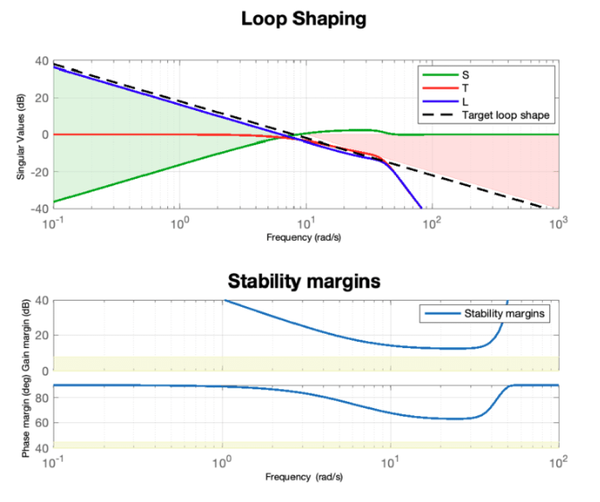
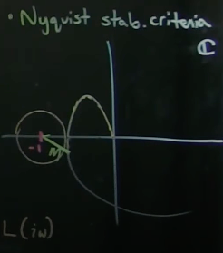
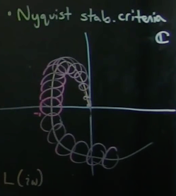

# Robust Control and Loop Shaping
## Motivation and Background
A paper by John Doyle proved that there is no guarantee on robustness of LQG scheme. This discovery pushed the industry towards robust control. We need to delve into Laplace domain and determine Robustness of a system. Laplace Transform domain gives us insights into the **performance, sensitivity, and robustness characteristics**.

## Three Equivalent Representations of Linear Systems
1. State space representation
    $$\dot{x}=Ax+Bu \\ y=Cx$$
2. Transfer functions
$$G(s)=C(sI-A)^{-1}B$$
3. Impulse response time domain
$$ y(t)=\int_{0}^{t}h(t-\tau)u(\tau)d\tau $$ 
This is a convolution between impulse response and control input

**Note** there are different usages for each of the three representations.
1. If physics can be represented, State space representation can be very useful. 
2. Transfer functions can be useful for investigating robustness and performance

---

## Deriving Sensitivity and Complementary Sensitivity with Loop Transfer Function

where d is disturbance, n is measurement noise, r is reference setpoint, P is the system transfer function, and K is the controller transfer function.

$$
L = PK
$$

Note K is applied first to the error before P.

$$
I*y = P_{d}*d+ PK(r-y-n), \text{where} (r-y-n) = \epsilon
$$

$$
(I+Pk)*y = PKr + P_{d}*d - PKn
$$

$$
y = (I+P*K)^{-1} * PKr + (I+PK)^{-1}P_{d}d - (I+PK)^{-1}PKn
$$

$$
\text{Therefore, } (I+PK)^{-1}PK \text{ is called complimentary sensitivity matrix, and } (I+(Pk))^{-1} \text{ is the sensitivity matrix}
$$
1. first term of y tracks trajectory
2. second term of y rejects disturbance
3. third term of y attenuates noise

---

## Sensitivity and Complementary Sensitivity Functions

In a standard negative feedback loop:

- Plant: $$ G(s) $$
- Controller: $$ K(s) $$
- Loop transfer function: $$ L(s) = K(s)G(s) $$

### 1. **Sensitivity Function** $$ S(s) $$

$$
S(s) = \frac{1}{1 + L(s)} = \frac{1}{1 + K(s)G(s)}
$$

- Measures the system's sensitivity to disturbances and model uncertainty.
- A smaller 
$$|S(j\omega)|\text{ means better disturbance rejection at frequency }\omega$$.

### 2. **Complementary Sensitivity Function** $$ T(s) $$

$$
T(s) = \frac{L(s)}{1 + L(s)} = \frac{K(s)G(s)}{1 + K(s)G(s)}
$$

- Measures the system's response to the reference input and its sensitivity to measurement noise.
- A larger 
$$|T(j\omega)|$$ at low frequencies means better reference tracking.

### 3. **Transfer Functions Bode Plots**

Error Term $$\mathcal{E} = r - y_{m} = S*r - S*P_{d}*d + T*n$$
where
- $$ n $$ is measurement noise
- $$ P_{d} $$ is disturbance Transfer Function and d is disturbance. $$ (\text{L loop output} + P_{d}*d=y) $$
- $$ r $$ is reference setpoint
- $$ S $$ is Sensitivity and $$ T $$ is Complementary Sensitivity

**Why does the Bode plot look like that?**
1. S needs to be small in low frequencies to minimize error $$\mathcal{E}$$ (first term in $$\mathcal{E}$$ formula), since a realistic $$ r $$ would be low in frequency for system to follow.
2. Reference Tracking and disturbance rejection are typically low frequency phenomemon.
3. T needs to be small in maganitude for high frequencies, since noise $$ n $$ is generally high in frequency.
4. $$ \omega_ {c} $$ denotes the **crossover frequency**, being the frequency at which Sensitivity starts to increase and Complementary Sensitivity begins to decrease. 
5. $$ \omega_ {c} $$ can be tuned to be where the user thinks noise begin to overwhelm the system.
6. **Peaks or bumps in Sensitivty transfer function is undesirable and needs to be attenuated**

### 4. **Relationship**

$$
S(s) + T(s) = 1
$$

---

### MIMO Case (Matrix Form)

Let:

- $$ G(s) \in \mathbb{R}^{p \times m} $$ be the plant
- $$ K(s) \in \mathbb{R}^{m \times p} $$ be the controller
- $$ L(s) = G(s)K(s) $$

Then:

$$
S(s) = (I + L(s))^{-1}
$$
$$
T(s) = L(s)(I + L(s))^{-1}
$$

These satisfy:

$$
S(s) + T(s) = I
$$

---

### Summary

| Function | Formula | Meaning |
|---------|---------|---------|
| $$ S(s) $$ | $$ \frac{1}{1 + K(s)G(s)} $$ or $$ (I + G(s)K(s))^{-1} $$ | Sensitivity to disturbances |
| $$ T(s) $$ | $$ \frac{K(s)G(s)}{1 + K(s)G(s)} $$ or $$ G(s)K(s)(I + G(s)K(s))^{-1} $$ | Response to reference / noise sensitivity |
| Relation | $$ S + T = 1 $$ or $$ S + T = I $$ | Always holds |

## Loop Shaping

1. The Bode plot of the Loop Transfer Function looks like an **Integrator**
    - high gain at low frequencies for good reference tracking and noise rejection (S needs to be small so L needs to be big )
    - low gain at high frequencies to attenuate noise
    - **bode plot can be shifted left or right by multiplying transfer function by $$\omega_{s}/s$$**
2. Loop shaping is a collection of several different design methods based on the idea of choosing a
compensator that gives a loop transfer function with a desired shape.
3.  One possibility is to start with the loop transfer function of the process and modify it by changing the gain and adding poles and zeros to the controller until the desired shape is obtained.

If you have a model for the system and a desired Loop Transfer Function, MATLAB can tune **K, the controller transfer function** to robustify control system. No LQG needed.

### Non-Robustness for Loop Shaping
The peaks in Sensitivity graph is undesirable since the larger the peak, the closer the controller system gets to instability (-1 point on the Nyquist plot).

where
$$
max|s|=1/m
$$

Therefore a larger peak in sensitivity **S** correspond to a closer distance to instability.

The actual system dynamics can rotate the curve (Phase) or shift it left to make the system unstable.

### Cone of Uncertainty

This takes into account of model uncertainty in P.

---

### Causes of Non-Robustness and Unstability
1. model uncertainty. The real system gain is smaller or bigger than the model
2. **Time delays.**
3. Right Half Plane (RHP) zeros of P (the system transfer function)

**Important Note:** Time delay and RHP zeros of P give a **fundamental limit** on how small $$max(|S|)$$ can be!
To satisfy these hard rules set by Time delay and RHP zeros, one needs to shift $$\omega_{c}$$ (the crossover frequency) to the left. This means the systems can only track low frequency references and reject lower frequency disturbances.

Recall: a RHP zero would cause the system to go in the wrong direction before converging. (This behavior is similar to a time delay.)

A RHP zero introduces Non-minimum Phase and would cause the system to go in the wrong direction before converging.

Example: 1. Aircraft gaining altitude. 2. parallel park.