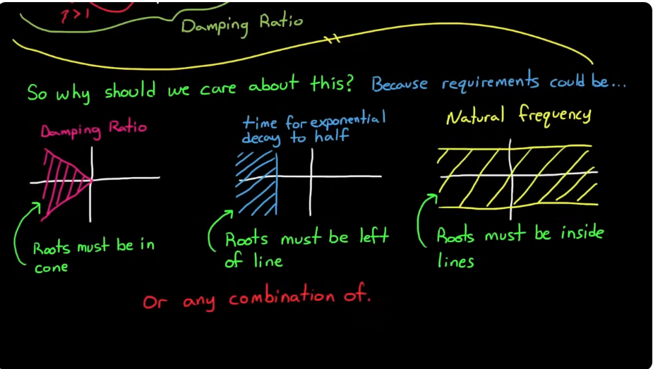
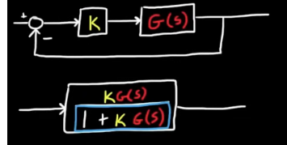
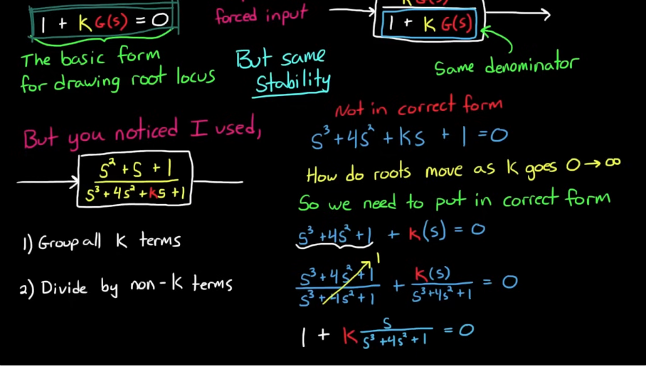

# Root Locus Analysis
## Poles and Zeros
1. The stability of an LTI system depends solely on the poles of its transfer function, including stability, speed of decay/growth, or natural oscillaitons.

2. Zeros (roots of the numerator) don’t directly affect stability because they don’t appear in the characteristic equation that governs the natural modes of the system.

3. Poles define how the system *naturally behaves* (transients, stability). Zeroes shape how the system reacts to inputs (modify transients, steady-state gain/phase, can cancel or distort modes)

### What can Zeros do?

1. Transient Shape and Overshoot
    - Zeros can introduce additional terms in the time response that can increase or decrease overshoot, depending on their location.
    - A zero close to the origin (s = 0) or near the imaginary axis can significantly change the transient waveform.

2. Direction and Phase
    - Zeros affect the phase of the frequency response.

3. Magnitude Shaping
    - Zeros can boost or attenuate specific frequency components, affecting bandwidth and disturbance rejection.

---

## Root Locus plot

Where $$\mathcal{Z}$$ is the damping ratio. $$\mathcal{Z}=1$$ means critically damped, $$\mathcal{Z}<1$$ means underdamped and $$\mathcal{Z}>1$$ means over damped.

The radial lines denote the lines of constant damping ratio $$\mathcal{Z}=cos(\phi)$$, which defines a **cone of damping ratio** to satisfy design specs.

---

### Typical Design Requiremnts - Applications of Root Locus Plots

### What is a Root Locus Plot?
root locus analysis is a graphical method for examining how the roots of a system change with variation of a certain system parameter, commonly a gain within a feedback system.

### Setting up Root Locus Plot
We need to get the pole to the correct form **1 + G(s) = 0**

---

## 10 Rules of Root Locus

Setting the system up in this form: $$ 1 + K \frac{Q(s)}{P(s)} $$ 

let

n = number of poles of G(s) (also the number of loci), the open loop transfer function\\
m = number of zeros of G(s)\\
l = 0, 1, 2, 3... natural numbers\\
q=order of repeated pole or zero\\
$$\psi_{p} = \text{angle from a pole}$$. Connect each pole with the pole/zero of interest, the angle between that line and positive x axis is $$\psi_p$$ \\
$$\psi_{z} = \text{angle from a zero}$$. Connect each zero with the pole/zero of interest, the angle between that line and positive x axis is $$\psi_z$$ 

**Rule 1**: There are **n** lines (loci), where $$ n = max(deg(Q), deg(P)) $$

**Rule 2**: As K increases from 0 to $$\infty$$, the closed loop poles move from the poles of open loop $$G(s)$$ to the zeroes of open loop $$G(s)$$\\
    - if there are same number of poles and zeroes, they form a pair the roots travel from one pole to a zero.\\
    - if there are more Poles than Zeroes, the lines from the extra poles go to $$\infty$$\\
    - if there are more Zeroes than Poles, the lines come from infinity to the extra zeroes

**Rule 3**: When roots are complex, they occur in conjugate pairs and move together but mirrored across the real plane

**Rule 4**: At no time will the same root cross over its path\\
    - Paths of other roots may cross each other

**Rule 5**: The portion of the real axis to the left of an odd number of open loop poles and zeroes are part of the loci\\
    - Another way to restate: For K>0, loci exist on the real axis to the left of odd numbered poles and zeroes

**Rule 6**: Lines leave and enter the real axis at $$90^\circ$$.

**Rule 7**: If there are not enough poles or zeroes to make a pair then the extra lines go to (for poles) or come from (for zeroes) infinity.

**Rule 8**: Line go to infinity along asymptotes \\
    - The angles of the asymptotes, $$\phi_{A} = \frac{(2l+1)}{n - m} * 180^\circ$$\\
    - Asymptotes intercept the real axis at $$\sigma_{0}$$ (ie. centroid of the asymptotes), $$\sigma = \frac{\Sigma \text{finite poles} - \Sigma \text{finite zeroes}}{n - m} $$\\
    - **Angle of departure** from a pole: $$\frac{1}{q}(\Sigma(\psi_z)-\Sigma(\psi_p)-180-360l)$$

**Rule 9**: If there are at least two lines to infinity, then the sum of all roots is constant

**Rule 10**: K going from 0 to $$-\infty$$ can be drawn by reversing rule 5 and adding $$180^\circ$$ to the asymptote angles.
    
---

### More details on the 10 rules

**Rule 2:** $$P(s) +KQ(s) = 0$$ by re-arranging the terms. When K = 0, P(s) = 0, which is the definition of poles for G(s). As K increases, more emphasis is put on Q(s)
