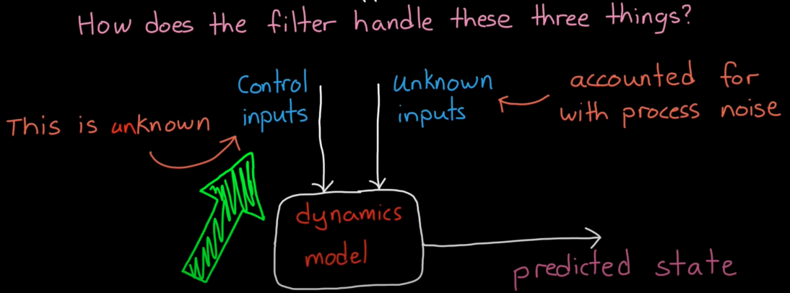
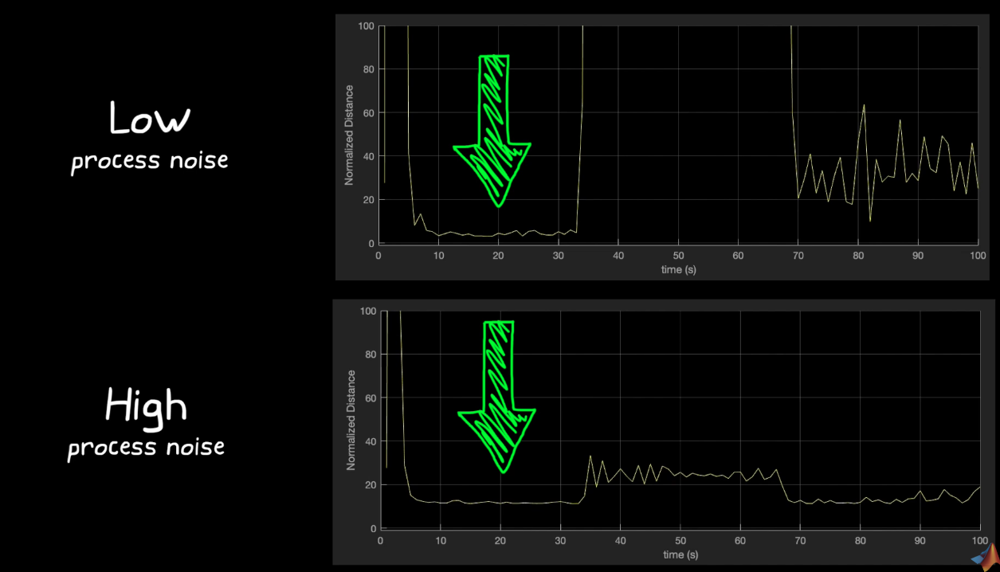

# Sensor Fusion

## Definition
Sensor fusion is a technique that combines two or more data sources in a way taht geneartes a more consistent, accurate, and dependable understanding of the system.

## Advantages and Use Cases
1. It can increase the quality of the data by fusing either two sensors of either the same type or different types together.

2. It can increase reliability.

3. It can estimate unmeasured states.

4. It can be used to increase coverage.

---

# Sensor Fusion Examples

## Attitude and heading reference system (AHRS)
To defin an orientation:
1. Reference Frame

2. Specify rotation

### Measuring Attitude and Heading

### Sensors - IMU (Magnometer, Accelerometer, and Gyro)
The absolute orientation for a static object can be determined just with M and A and taking cross products.

**Magnometer** measures the strength and direction of a magnetic field and determines heading relative to the Earth's magnetic north.

    - readings can be corrupted by other magnetic sources.
    - Hard Iron sources (Magnet or Coil) shift the sphere, soft irons (nails) distorts the sphere. Sphere refers to 
    - needs to calibrate by rotate the device around

**Accelerometer** measures acceleration

    - if the accelerometer is not at center of rotation, readings can be off.
    - linear acceleration can corrcupt Acc measurement of "down"

**Gyro** measures angular rate
    - Dead reckoning refers to integrating gyro readings (integration is a low pass filter, which filters out high frequency noise)
    - Gyros have drift

### Sensor Fusion algorithm for IMU
1. Initialize attitude
2. Use mag field and gravity to correct gyro drift

In **complementary filter**, the user decides how much accel+mag and gyro data need to be trusted. Kalman filter automatically computes the confidence.

---

## Sensor Fusion with GPS and IMU: Algorithm - Extended Kalman
GPS measured velocity and position.
If GPS reading doesn't need to be very accurate or fast, adding IMU is not helping much. (driving with google maps)
If GPS reading needs to be accurate and fast velocity constantly changing, adding IMU helps. (drone flying around obstacles)

**Estimating the sensor bias is extremely imporant** because bias drifts over time.

### Step 1: Initializing the filter

**28 state kalman state vector:**  
1. Orientation (4 states quaternion)
2. Angular Velocity(XYZ) (3) where XYZ means angular rates about body x,y,z, axes
3. Position (NED) (3)
4. Velocity (NED) (3)
5. Acceleration (NED) (3)
6. Accelerometer Bias (XYZ) (3)
7. Geomagnetic Field Vector (NED) (3)
4. Magnetometer Bias (XYZ) (3)

If no estimates of sensor bias is available at system start, let the kalman filter converge to the correct solution while the vehicle is stationary.

**Note:** Extended Kalman linearizes the nonlinear model at current estimate and uses the linear model to predict state into the future. If the filter is not initialized close to the true state, the linearization result would deviate and estimate would not converge.

Initializing a real system

### Step 2: Kalman
**Predict** and **Correct**

1. Predict the state based on model and keep track of confidence (Process Noise). When new measurement comes in with measurement noise, the filter compare the measurement with predicted model and corrects its estimate based on the confidence.

2. If there is an update from any of the sensors, update the state based on the relative confidence based on the estimate and the measurement.

    - The sensor can therefore run with **asyncronous measurements**

---

# Tracking Remote Objects

## Interacting Multiple Model Filter (IMM) - How to track a single remote object with remote sensors

Tracking a remote object. Key difference: with Kalman filters, one knows the state model to predict the future state of an object. However, when tracking a remote object, we typically don't have access to the input to the plant.

Cooperative Tracking: tracked object shares control input.

Unkown inputs are taken into account by **process noise**.

Uncoorperative Tracking: tracked object does not share control input.

---

### Uncooperative tracking with a remote object

Trade-off between High process noise and low process noise.

Example: constant velocity model but don't know the exact control inputs

Scheme: Increase Process noise to trust prediction less and trust measurement more. This would reduce noise when the actual dynamics is not constant velocity. However, this comes at the cost of error for area which the model predicts the dynamics well (constant velocity case).

---

### Interactive Multiple Model Filter (single object tracking)
To have one model for each type of motion. Allowing each model to interact to reduce transient error

Interactive Multi-Model filter vs Multi-Model Filter
1. IMM reduces transient error compared to independent models in Multi-Model filters
2. IMM blends all models together based on the likelihood of each representing the true motion

### Disadvantages of too many models in IMM
A large number of models for IMM can introduce both computationall cost and performance hit

Performance:
1. More models means more transitions between models
2. Harder to know when to make a transitions

Try to find the **smallest number** of models that adequetly predicts the possible motion of the object you're tracking.

---

## Tracking Multiple Remote Objects
