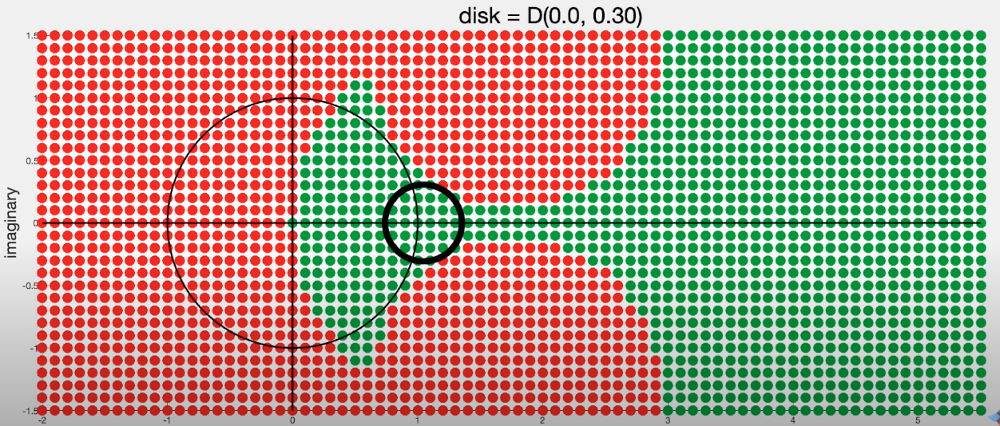
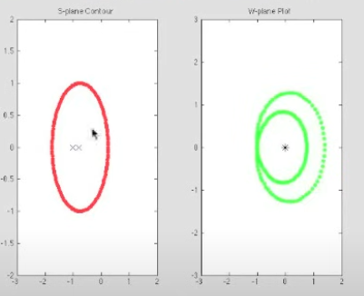

# Stability Analysis

## Stability Margins - Gain and Phase Margins
In simple terms, Gain and Phase margins are the safe net and the extra that protects us from instability.
less margin = less stable

**Note:**
*Gain* crossover frequency is used to caluclate *Phase* Margin.

*Phase* crossover frequency is used to caculate *Gain* Margin.

The Gain and PhaseMargins are **defined with respect to open-loop transfer function**, but the margins are not intrinsic properties of the open-loop system alone, and are only meaningful for the corresponding closed-loop system.

---

### Gain Margin

The gain margin (GM) is defined at the phase crossover frequency 
$$ \omega_{pc}  \text{ where } \angle L(j\omega_{pc}) = -180^\circ $$:

$$
GM = \frac{1}{|L(j\omega_{pc})|}
$$

In decibels (dB):

$$
GM_{\text{dB}} = -20 \log_{10} |L(j\omega_{pc})|
$$

If there are multiple **Phase crossover frequencies $$\omega_{pc} $$**, use the most conservative Gain Margin.

### Phase Margin

The phase margin (PM) is defined at the gain crossover frequency 
$$ \omega_{gc} $$ where $$ |L(j\omega_{gc})| = 1 $$:

$$
PM = 180^\circ + \angle L(j\omega_{gc})
$$

Delay in the system (e.g. delay in digital computers) only affects the phase plot and shifts it down.

### Margins and Sensitivity

Peaks in Sensitivity Plots are directly correlated with Gain and Phase Margins. The smaller the margins, the bigger the peak.

### Real World Cases
1. Changing one parameter in the characteristic equation can have a larger effect than anticipated. Gain and Phase margin only apply separately to a whole open-loop system, and uncertainty in one particular parameter can drastically change the bode plots and therefore the margins.
2. The Bode Plots can indicate infinite margins but be cautious about any dips in the phase plot, as the margins are small in those areas.

---

## Why use Disk Margin?
1. Even though increasing delay or increasing gain individually (reducing GM and PM respectively) may not cause the system to be unstable, adding a mix of the two can unstabilize the system. The disk margin therefore needs to be considered. To anaylze the effect of adding phase and gain, use Nyquist Plot.

2. Disk margin can be used on MIMO.

## Disk Margin

The disk reads "Given $$e=0.0$$, the maximum disk margin is 0.56"

### Parameters of the disk
The disk must be fit entirely in the stable region and includes the nominal point $$f =1 + 0i$$
1. Skew factor $$e$$. how far off the center of the disk is to the nominal point.
2. $$\alpha$$ measures the size of the disk. It represents the size of the disk given a certain $$e$$ such that the disk is entirely in the stable region.

### Disk Placement
You can choose where the disk is:

1. If you think real system gain is bigger than model gain, use a bigger $$e$$

   - If unsure, choose $$e = 0.0$$

2.  Disk margin may not be conservative even if it may only covers a small area of stability zone.

    

    - in this case, while gain margin is bigger, at those bigger gain values, not much wiggle room for phase -> not optimal

3. May need to check all three margins to ensure accurate representation of the stability.

    - Some systems are robust to pure phase or gain variations but not a mix of the two

    

---

## Closed Loop Stability

In a non-unity feedback system whose feedback transfer function is $$H(s)$$, the closed loop transfer function is $$\frac{G(s)}{1+GH}$$. We can study the stability of the closed loop transfer function by identifying the **zeros** of $$1+GH$$.

**Adding 1 to the Nyquist plot of the open loop transfer function shift the plot to the right by 1**

---

## Nyquist Criterion — Bode/Nyquist Terms (Unity Feedback)

### Cauchy's Argument Principle

A *contour* in S-plane maps to a *plot* in W-plane. The phaser for any point on the contour is the same as the phaser for its mapped counterpart in the W-plane. The mapping is done by the transfer function.

To compute the phaser:
1. Choose a point in the S plane.
2. Draw phasers by connecting that point of interest to all the zeros and poles in the S-plane.
3. To compute the magnitude of the phaser in W-plane, multiply all magnitudes of the zero phasers (**in S-plane**) and divide by the magnitudes of the pole phasers (**in S-plane**).
4. To compute the phase of the phaser in W-plane, add the zero phases **in S-plane** and subtract the pole phases **in S-plane**. The phase here refers to the angle between the phaser and the positve x-axis.

We use the above method to trace a contour in the S-plane and visualize the plot on the W-plane.

**Notes:**
1. Given the above steps, we can see that if the contour does not include any poles or zeroes, the phase in W-plane would never go around $$360^\circ$$.  
2. If the contour encircles a pole, the resulting plot on W-plane circles the origin in the counter clockwise direction. This is because we are subtracting pole phases.

  - for each encircled pole on a contour, there's a circle around the origin on the plot in W-plane.

3. Encircling a zero in the S-plane does similar things in W-plane but flip the direction to clockwise.
4. If there are same number of zeros as poles, the resulting plot in W-plane does not encircle the orgin at all.

  

We can get the difference between the number of poles and zeros in the S-plane just by looking at if the plot in W-plane encircles the origin and if so, in what direction.

1. If the plot in W-plane (ie, after propagating through the transfer function) encircles the origin once in the clockwise direction, there is 1 **more** zero than poles in the original system.
2. If the plot in W-plane (ie, after propagating through the transfer function) encircles the origin once in the counter-clockwise direction, there is 1 **more** pole than zeros in the original system.
3. If the plot encircles the origin twice in the clockwise direction, there are 2 **more** zeros than poles in the original system.

 

---

## Using Cauchy's Argument Principle for Closed-loop Stability Analysis (Are there any zeroes in RHP for $$1+L(s)$$)
### Why RHP zeros of $$1+L(s)$$?
1. An open loop system is stable if and only if there is *no RHP poles*, which happens when the **denominator** of L(s) equals 0.
2. Since $$1+L(s)$$ is the new denominator of the closed loop transfer function $$\frac{G}{1+GH}$$, we want there to be no RHP zeros.

### Using Cauchy's Argument Principle and Nyquist Contour
Since we need to know if there is any RHP zeros for $$1+GH$$, we need a contour that encloses the right half plane - $$Nyquist contour$$ on S-plane.

When the **Nyquist contour** is mapped through a transfer function to the W-plane, we get a **Nyquist plot**. The Nyquist plot is plotted by pluggin in every single frequency on the imaginary axis and all the points along with infinity on the RHP in the S-plane.

Instead of 1+GH, we can shift the plane to the left by -1 and only investigate the **Open-loop** transfer function $$GH$$.

By looking at the Nyquist plot, we can see how many times the -1 point is encircled and in which direction.

Steps:
1. Get Nyquist plot of Open-loop transfer function $$G(s)H(s)$$
2. Count encirclements of -1, note direction.
3. Determine how many more poles or zeros are in the RHP. We can do this since we typically know how many poles are in the RHP for $$GH$$

Therefore,

$$Z=N+P$$

where Z is the number of zeros of $$1+GH$$, N is the number of times the Nyquist plot encircles -1 in the clockwise direction, and P is the number of open loop poles in the RHP (unstable open-loop poles) 

To guarantee no RHP zeros for $$1+L(s)$$, we need to have 1 counterclockwise encirclement for every open-loop RHP pole.

This prperty allows to use Nyquist plots to analyze both stable and unstable open-loop system, unlike the bode plot, which only pertains to stable open loop systems.

---

### Nyquist Criterion

**Setup.** Let the open-loop transfer be $$G(s)$$ for a unity-feedback loop with closed-loop characteristic $$1+G(s)=0$$. Let:
- $$P$$ = number of open-loop poles of $$G(s)$$ in the right-half plane (RHP),
- $$N$$ = number of *clockwise* encirclements of the Nyquist critical point $$-1+0j$$ by the Nyquist plot of $$G(j\omega)$$ (standard Nyquist contour),
- $$Z$$ = number of closed-loop poles in the RHP.

**General Nyquist criterion.**
$$
Z = N + P.
$$
The closed loop is **stable** iff $$Z=0$$. Equivalently, the Nyquist plot must encircle $$-1$$ **clockwise** exactly $$N=-P$$ times.

**Common special case (open-loop stable, i.e., $$P=0$$).**
If $$G(s)$$ has no RHP poles and no poles on the $$j\omega$$-axis (aside from allowable integrators handled with the modified contour), then:
- Closed loop is stable **iff** the Nyquist plot of $$G(j\omega)$$ **does not encircle** $$-1+0j$$ (i.e., $$N=0 \Rightarrow Z=0$$).

---

### Bode-plot restatements (margins)

Let $$\omega_{gc}$$ be a gain-crossover frequency 
where $$|G(j\omega_{gc})|=1$$, 
and let $$\omega_{pc}$$ be a phase-crossover frequency
 where $$\angle G(j\omega_{pc})=-180^\circ$$.

- **Phase margin condition (at gain crossover):**
  $$
  |G(j\omega_{gc})|=1 \quad \Rightarrow \quad \angle G(j\omega_{gc}) > -180^\circ
  $$
  (positive phase margin). This ensures the Nyquist plot does **not** cross the real axis at or left of $$-1$$.

- **Gain margin condition (at phase crossover):**
  $$
  \angle G(j\omega_{pc})=-180^\circ \quad \Rightarrow \quad |G(j\omega_{pc})| < 1
  $$
  (positive gain margin). This keeps the Nyquist locus inside the unit circle when it is at $$-180^\circ$$, avoiding the point $$-1$$.

If **both** conditions hold for all relevant crossovers and $$P=0$$, the loop has positive stability margins and the closed loop is stable.

---

### Notes/Caveats

- If $$P>0$$ (open-loop unstable), you **must** have exactly $$N=-P$$ clockwise encirclements of $$-1$$. Simple “margin checks” at crossovers are insufficient without accounting for $$P$$.
- Poles on the imaginary axis (e.g., pure integrators) require the standard indentation in the Nyquist contour; apply the modified criterion accordingly.
- The above statements presume unity feedback; for non-unity feedback, apply the criterion to the appropriate open-loop function that multiplies the feedback path.

