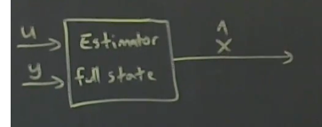

# State Estimation
## Measurement Model
$$\dot{x}=Ax+Bu, y=Cx, x\in\mathbb{R^n}, y \in\mathbb{R^p}$$
## Observability
In simple terms, **observability** is if any state in x can be reproduced and deduced from measurements y(t)
## Observability Matrix
$$
\mathbb{O} = \begin{bmatrix}
C \\
CA \\
CA^2 \\
\vdots \\
CA^{n-1}
\end{bmatrix}
$$
This is a tall matrix and therefore its rank is the column rank.
**Note** that the C matrices are measurement matrices, not controllability matrices.
1. The system is observable if rank(O)=n.
2. The full state x can be estimated from y.
3. **Degrees of Observability** can be calculated from the **Observability Gramian** and the **SVD**

---

## Kalman Filter (Linear Quadratic Estimator)
### Notes
1. **Both Kalman Filter and LQR solve an algebraic Riccati Equation, yielding a closed-form solution**
2. The algebraic Riccati Equation for Kalman filter is very similar to that of LQR.
3. Kalman filter gain ($$K_{k}$$) is derived by minimizing the estimate coveriance matrix $$P_{k}$$

Kalman is a **Full State Estimator** that measures full state $x(t)$ given the knowledge of the measurement $$y(t)$$ and control input $$u(t)$$. The eigenvalues of the Kalman filter signifies how fast estimates converge to the true state. Pole placement can be performed on Kalman to find the optimal eigenvalues. More aggressive poles means Kalman will be more susceptible to external noise.

### Kalman Cost Function
$$J= \mathbb{E}[(x-\hat{x})^T(x-\hat{x})]$$

### Measurement Noise
$$ \epsilon = x - \hat{x} \\ \dot{\epsilon}=(A-KC) \epsilon + w_{d} - Kw_{n}$$, where K is the Kalman gain and C is the measurement matrix, W_{d} is the process noise from system dynamics and w_{n} is the sensor noise
### Two Major noises
1. Model Noise $$w_{d}$$
2. Measurement Noise $$w_{n}$$
if one is high, trust the other more.
