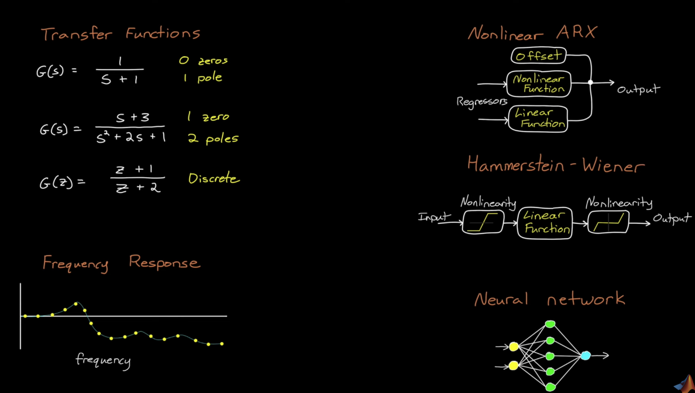

# Motivation

## Model

### Use Cases
1. Controller Design 2. State Estimation 3. Formal Analysis 5. Simulation

### Model Components
1. Structure - e.g. second order differential equations, frequency response, process model (with time delay), neural networks  
2. Parameters - e.g. physical quantities - mass, spring constant

### How to create a model
Scenario 1: You know a lot about the physical system -> **white box** approach: create model directly from **first principles**

Scenario 2: You don't know much about the system -> **black box** approach: **pure system ID**

Scenario 3: You combine first principles with fitting ->**grey box** approach: use first principles to derive structure and fit parameters

---

# Linear System Identification
Linear, Nonlinear, Online and Recursive system ID. System ID is a data driven method
 
Choose a model structure that represents the system dynamics and fit a model to the data by picking the parameters

## System ID vs Curve fit

### Curve fit $$y=f(t)$$

Curve fit only describes the sequence of data but doesn't describe the underlying mechanisms that created the data. For instance, curve fitting cannot predict the data if system was initialized at different state or even different inputs.

### System ID $$y=f(u,y,t)

System ID takes into account of correlation between the data points, which depends on previous system state. 

## Typical System ID model candidates

---

# System ID workflow

