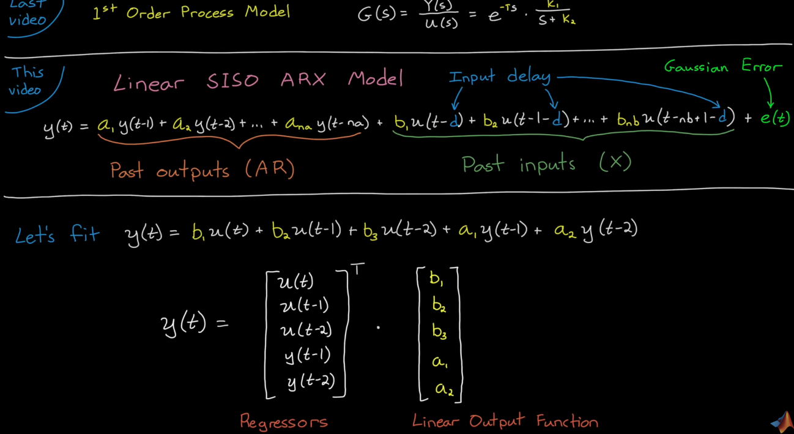

## Motivation - Why do we need System ID
1. Model for Control Design - PID, MPC, LQR
2. Model Updating - Wear and tear in system, or operate in varying environments.
3. Complex Systems - aerodaynamics can be hard to model.

## Model

### Use Cases
1. Controller Design 
2. State Estimation 
3. Formal Analysis 
5. Simulation

### System ID Types
1. Linear
2. Nonlinear
3. Online and recursive

### Model Components
1. Structure - e.g. second order differential equations, frequency response, process model (with time delay), neural networks  
2. Parameters - e.g. physical quantities - mass, spring constant

### How to create a model
Scenario 1: You know a lot about the physical system -> **white box** approach: create model directly from **first principles**

Scenario 2: You don't know much about the system -> **black box** approach: **pure system ID**

Scenario 3: You combine first principles with fitting ->**grey box** approach: use first principles to derive structure and fit parameters

---

# Linear System Identification
Linear, Nonlinear, Online and Recursive system ID. System ID is a data driven method
 
Choose a model structure that represents the system dynamics and fit a model to the data by picking the parameters

## System ID vs Curve fit

### Curve fit $$y=f(t)$$

Curve fit only describes the sequence of data but doesn't describe the underlying mechanisms that created the data. For instance, curve fitting cannot predict the data if system was initialized at different state or even different inputs.

### System ID $$y=f(u,y,t)$$

System ID takes into account of correlation between the data points, which depends on previous system state. 

## Typical System ID model candidates

---

# System ID workflow

## Selecting a Model Order

### Hankel Singular Value
1. Hankel Singular Values are caluclated by taking the SVD of the Hankel matrix.
2. Hankel Singular values can be plotted against model order to show redundant orders to reduce the system.

## Modeling a Real System
1. Model the system.
2. Model the dynamics of disturbance.

### Whiteness and Correlation Tests
**Residual**: 
1. Initialize model at first data point (t=0), predict y at the next time step (t = 1). Caluclate error.
2. Initialize model at second data point (t=1), predict y at the next time step (t = 2). Calculate error.

...

3. Initialize model at n-th data point (t = n + 1), predict y at the next time step (t = n + 2). Calculate error.

We have a residual curve.

**Residual Autocorrelation:** If residual values are correlated with themselves in some way -> there is unmodeled dynamics in disturbance model.

**Residual-Input Cross-Correlation:** If residual values are highly cross-correlated with input -> there is unmodeled dynamics in system model.

---

# Nonlinear System ID

## Linear ARX (Auto-Regressive Exogeneous Input) SISO

An **ARX system** is a type of discrete-time, linear, time-invariant model used in **system identification**, where the output is modeled as an **Auto-Regressive model with eXogenous input**.

The system is described by a linear difference equation:

$$
y(t) + a_1 y(t-1) + a_2 y(t-2) + \dots + a_{n_a} y(t-n_a) = b_1 u(t-1) + b_2 u(t-2) + \dots + b_{n_b} u(t-n_b) + e(t)
$$

Where:
- $$ y(t) $$ — output at time $$ t $$  
- $$ u(t) $$ — input at time $$ t $$  
- $$ e(t) $$ — white noise (modeling disturbances)  
- $$ a_i $$ — parameters of the autoregressive part (based on past outputs)  
- $$ b_i $$ — parameters of the exogenous part (based on past inputs)  
- $$ n_a $$ — number of past outputs used  
- $$ n_b $$ — number of past inputs used (often includes a delay $$ n_k $$)  

In compact notation:

$$
A(q^{-1})y(t) = B(q^{-1})u(t) + e(t)
$$

where $$ q^{-1} $$ is the **backward shift operator** ($$ q^{-1} y(t) = y(t-1) $$).

---

### Key Points
- **AR** part: models how past outputs affect the current output.  
- **X** (exogenous) part: models how past inputs affect the current output.  
- **Linear** in parameters — easy to estimate using least squares.
- Assumes disturbances $$ e(t) $$ are uncorrelated with the inputs.

---

## NLARX Model (Linear Regressors + Linear output function(y) + Offset)

Note that the offset term makes a linear system nonlinear. A linear system with an offset is called **affine**.

### idLinear
1. Linear function for input
2. Offset term to make the system affine.

---

## NARX Systems

A **NARX system** is a **Nonlinear Auto-Regressive model with eXogenous input**.  
It extends the ARX model by allowing **nonlinear relationships** between past inputs, past outputs, and the current output.

The general form is:

$$
y(t) = F\big( y(t-1), y(t-2), \dots, y(t-n_a), \; u(t-1), u(t-2), \dots, u(t-n_b) \big) + e(t)
$$

Where:
- $$ y(t) $$ — output at time $$ t $$  
- $$ u(t) $$ — input at time $$ t $$  
- $$ e(t) $$ — noise or disturbance  
- $$ n_a $$ — number of past outputs used  
- $$ n_b $$ — number of past inputs used  
- $$ F(\cdot) $$ — a **nonlinear mapping function** (e.g., neural network, polynomial, or other nonlinear model)

**Note** each of the term may be multiplied by non-linear functions like Fourier-Series. 

---

### Key Points
- While it is possible to capture the entire system with nonlinear dynamics, it is generally not recommended since there is no global stability guaratnee.
- To better understand the system dynamics while accounting for non-linear dynamics, we generally use a **linear combination** of nonlinear regressors to model the bulk of the system, and use **non-linear combination** to capture the remaining nonlinear dynamics.
    - A linear combination of nonlinear regressors is still linear.
- Generalizes ARX by replacing the linear mapping with a **nonlinear function**. ie $$(y(t-1))^2 + \sqrt{u(t-1 )}$$
- Captures complex, nonlinear system dynamics more accurately than ARX.
- Commonly used in **machine learning–based system identification**.
- If $$ F(\cdot) $$ is linear, the NARX model reduces to the ARX model.

## Stability of NARX
No guarantee of globall stability past captured data. We can approximate the bulk of the system with a linear model which we can analyze the stability of, and capture the remaining residuals with nonlinear terms.

---

## Online and Recursive System ID

The model is developed online over time, using data once it becomes available at each time step. This method is beneficial for **time-varying systems**.

### Use Cases of Online System ID
1. Adaptive Control

    - Time varying systems

2. Fault Detection

    - Create fault tests in real time

### Finite History Algorithms
Only use part of the most recent past data with a fixed-length window. Online algorithms needs fast execution, so we only use linear models for now.

However, we need to **store these data**.

### Infinite History (Recursive) Algorithms

Every single data point is run recursively but not stored. Faster execution time.

Method 1: Pick a fixed gain K:

Method 2: Since fixed gain is not optimal enough:

Use Kalman!!!