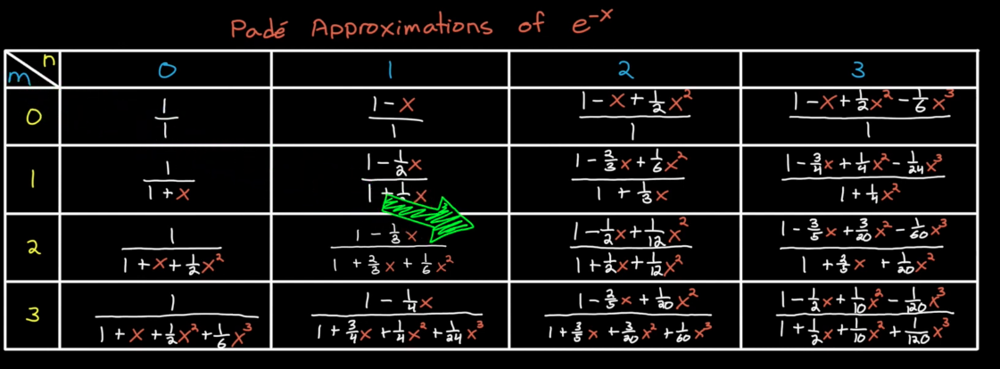
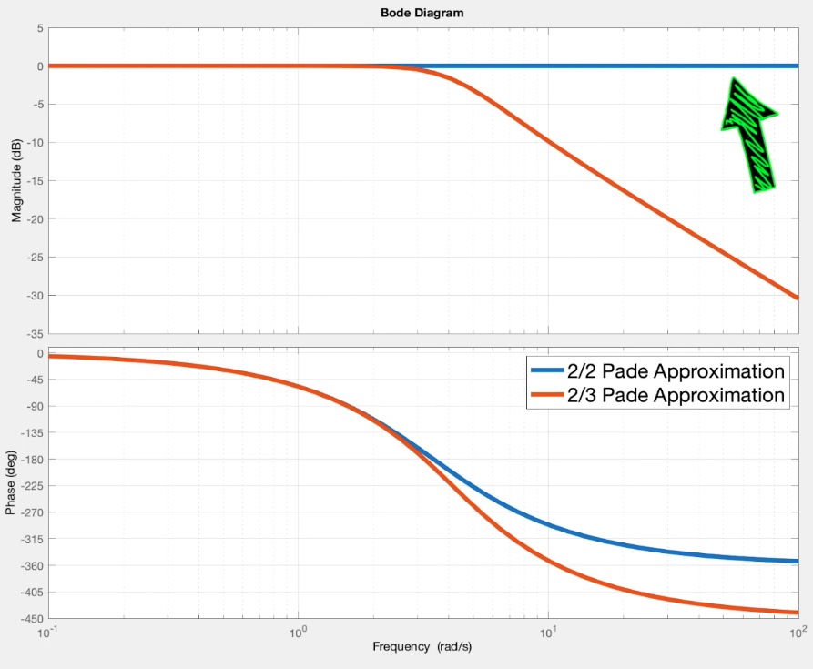
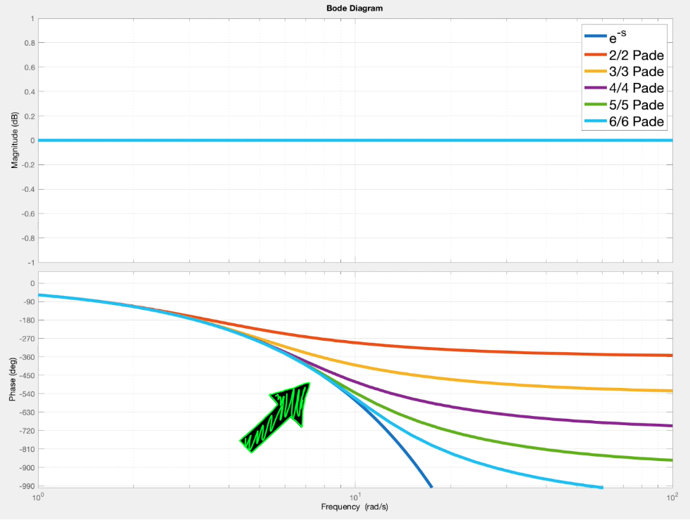
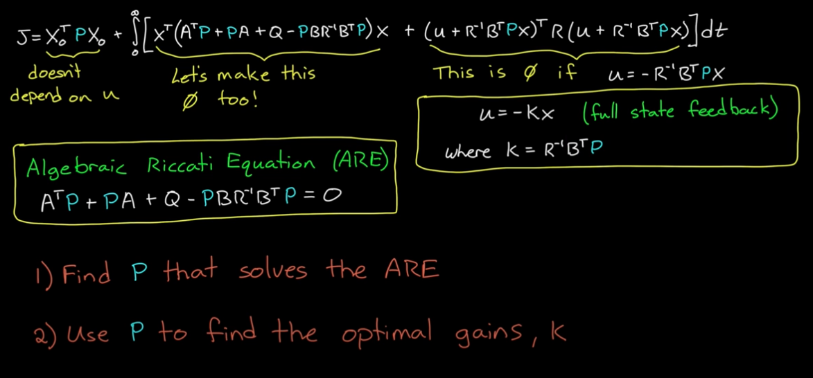

# Pade Approximations
Pade Approximations is a technique that approximates any function with rational polynomial (any numerator order or denominator order). Pade Approximations generally produces better results than the Taylor Series since it introduces both poles and zeros rather than just zeros in Taylor Series.

Pade Approximations allows us to control systems with time delay with LQR and $$H_{infinity}$$, and not limit ourselves to robust control techniques like loop-shaping.

In most real-world scenarios, Pade Approximation yields better results than Taylor Series, making it an advanced method for modeling time delay and ZOH.

## Motivation
In Continuous time domain, time delay is essentially an infinite poles. Root locus, LQR, $$H_{infinity}$$ wouldn't work for systems with time delays, since it is of infinite state. We can solve this by using [Pade Approximation](./techniques.html).
    - Root Locus shows the trajectory of closed-loop poles, which is anchored by open-loop poles and open-loop zeros. It cannot show infinite poles for time delays.
    - LQR wouldn't work for time delays since it would require and infinite state feedback loop.
    - $$H_{infinity}$$ would generate an infinite state controller for time delay system.

## Pade Approximations of $$e^{-x}$$ (Useful for Approximating Time Delay)

## General Formula

$$
R(x) = \frac{\sum_{j=0}^{j=n} a_j x^j}{1 + \sum_{k=1}^{n} b_k x^k}
$$

## Steps to Calculate Pade Approximations
1. Use Formula and choose $$m$$ and $$n$$
2. Equate the resulting PA formula to (m+n) Taylor Series, and solve for the coefficients $$a_i$$ and $$b_i$$.
3. Plug the solved coefficients back to the formula.

## How to choose m and n? Why does m = n needs to hold for modeling time delay?
1. When using Pade Approximation to model *time delays*, $$ m = n $$ **needs to hold**, since this guarantees only changes in *phase* and not *gain*.
    - This accurately models time delay since time delays don't affect gains.
    <figure style="text-align: left;">
    
    <figcaption>Pade m = n for Time Delay Approximation. Otherwise, gain is changed.</figcaption>
    </figure>

2. To choose m = n, We need to evaluate the amount of time delay and system speed.
    - The higher the Pade Approximation order (m=n), the better high-frequency features are approximated on the phase plot.
    - The cutoff frequency of the system (gain drops below -3 dB) determines the order.
    <figure style="text-align: left;">
    
    <figcaption>Higher-frequency features are approximated better by higher order Pade Approximations</figcaption>
    </figure>

---

# Algebraic Riccati Equation

After some term re-arragnement, the cost function $$J(x,u)$$ for LQR can be written as:

**Notes:**

1. $$P$$ is solved to make the first part of the integral operand 0 (minimizes cost).
2. Plug in $$P$$ to compute $$K = R^{-1}B^TP$$, which, when plugged into $$ u = - K x $$,  makes the second term of integral operand 0, where $$ R $$ is the cost matrix for control effort and $$B$$ is the control input Matrix.

## Quadratic Cost

$$
J = \int_{0}^{\infty} (x^T Q x + u^T R u) dt
$$

where Q is the process Noise Covariance, and R is the Measurement Noise Covariance.

## Solving LQR with ARE (Finding u to minimize J)

Other methods such as brute force or gradient descent are computationally expensive. ARE yeilds an analytic solution in comparison.

Let $$P = P^T$$, $$P$$ is the Estimate Error Covariance, and represents how uncertain the filter currently is about the estimated state.

$$
A^\top P + P A - P B R^{-1} B^\top P + Q = 0
$$

---

# Runge-Kutta Numerical Integration

## Motivation
Given a vector field $$\dot{x}=f(x,t)$$, how to numerically integrate to get future values.
### Forward Euler (first order Runga Kutta)
$$x_{k+1} = x_{k} + \Delta t * f(x_k, t_k) = x_k + \Delta t * f_1$$
Euler Integration is inaccurate.

## Runge–Kutta 2nd Order (RK2)

Given the ODE:  
$$
\frac{dy}{dt} = f(t, y), \quad y(t_0) = y_0
$$

Step size: $$h$$

Algorithm:

1. Compute:

   $$
   k_1 = f(t_n, y_n)
   $$

   $$
   k_2 = f\!\Big(t_n + h, \; y_n + h k_1\Big)
   $$

2. Update:
   $$
   y_{n+1} = y_n + \frac{h}{2}\big(k_1 + k_2\big)
   $$

**OR** in one step:

$$
x_{k+1} = x_k + \Delta t f(x_k + \frac{\Delta t}{2} f(x_k, t_k), t_k + \frac{\Delta t}{2}))
$$

**Optimality**

RK2 means the method is globally optimal in $$\sigma (2)$$, while being locally optimal in $$\sigma (3)$$.

### Intuition behind RK (2)
1. A half step along the vector field at $$f_1(x_k,t)$$

---

## Runge–Kutta 4th Order (RK4)

Given the ODE:  
$$
\frac{dy}{dt} = f(t, y), \quad y(t_0) = y_0
$$

Step size: $$h$$

Algorithm:

1. Compute:
   $$
   k_1 = f(t_n, y_n)
   $$
   $$
   k_2 = f\!\Big(t_n + \tfrac{h}{2}, \; y_n + \tfrac{h}{2} k_1\Big)
   $$
   $$
   k_3 = f\!\Big(t_n + \tfrac{h}{2}, \; y_n + \tfrac{h}{2} k_2\Big)
   $$
   $$
   k_4 = f(t_n + h, \; y_n + h k_3)
   $$

2. Update:
   $$
   y_{n+1} = y_n + \frac{h}{6}\big(k_1 + 2k_2 + 2k_3 + k_4\big)
   $$

___

# Phase Portraits

